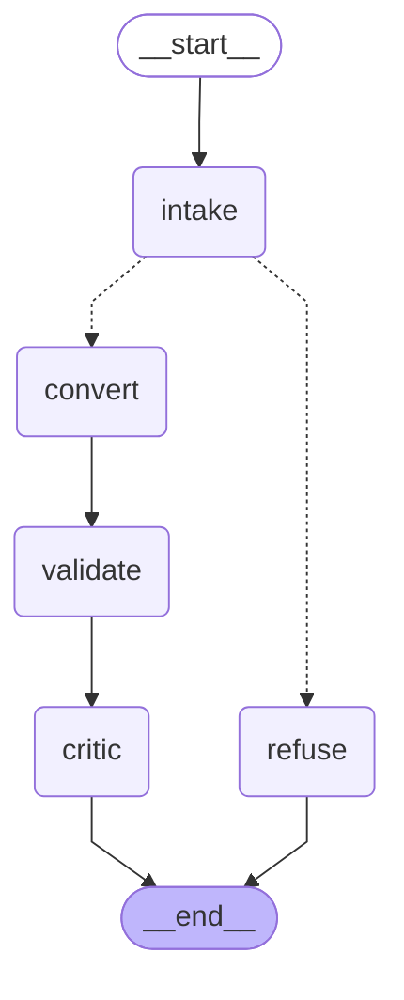

# 🚧 Selenium2Playwright — work in progress

**An AI agent that converts TypeScript Selenium test suites to Playwright** — a single test, a page object, or the whole suite — built on LangGraph + Claude, with a self-correcting loop that validates its own output before you ever see it.

> **Status: building in public.** Phase 5 of 12 in progress — **M2 in progress**. The graph now runs `intake → convert → validate → critic`. Four deterministic gates check the code, then a model review returns a structured pass/revise verdict and concrete fixes. Failed gates cannot be overridden by the critic. Code, validation findings, and the review are emitted together; the bounded repair loop comes next. See the [critic walkthrough](docs/critic-node.md) and [gap log + failure taxonomy](docs/gap-log.md).
> Architecture & decisions: [plan.md](plan.md)
>
> 🗺️ **[Interactive architecture diagram](https://claude.ai/code/artifact/877b27e1-3cc2-4f84-802f-091419bf27c1)** — the whole system on one page: the pipeline, the reflection loop, memory, evals, and the v2 AgentCore path. *(Source: [docs/architecture.html](docs/architecture.html))*

## The thesis

Migrating a Selenium suite to Playwright is mechanical enough to automate, but risky enough that "an LLM rewrote it" isn't good enough. So this agent is built on one rule: **the model can't lie to the compiler.** Every conversion must pass deterministic gates — `tsc --noEmit`, typed ESLint, a Selenium-residue scan, and structure parity (the converted suite keeps the same test cases and assertion coverage as the original) — and a critic loop repairs what fails, re-running up to 3 times before anything reaches you. Whatever can't be verified ships as an explicit `TODO(review)`, never silently.

## The graph today

Generated from the compiled graph with `build_graph().get_graph().draw_mermaid()`. Dotted edges are the conditional branch: `intake` classifies the file with plain heuristics and routes to `convert` or to an honest `refuse`. Converted files pass through `validate`, then `critic`. The critic reads the source, conversion, companions, and validation reports; this step reports a review without rewriting the code.

Try it: `uv run python -m selenium2playwright.graph samples/selenium-suite/pages/LoginPage.ts` prints converted TypeScript to stdout and the scorecard/review to stderr. A supported conversion makes two model calls: conversion, then review. Exit codes: 0 = all gates and critic pass, 1 = failed validation, requested revision, or unavailable critic, 2 = unsupported input or invalid CLI arguments. See the [companion-file example](docs/validation-node.md#run-a-conversion) for converting a test against its page object.

## Why an agent — and not just Claude in a repo?

Fair question: Claude in a chat can convert a Selenium file. The difference is what you can trust *unattended*:

| | Claude in a chat / repo | This agent |
|---|---|---|
| **Verification** | you review everything by hand | output must pass compile, lint, residue and parity gates; a critic loop repairs failures (up to 3 passes) *before you see the code* |
| **Parity** | test cases or assertions can silently vanish in translation | test count and assertion coverage are checked against the source suite — a mismatch triggers self-correction, never a silent drop |
| **Quality** | depends on that day's prompt — vibes | scored on a fixed eval dataset (compile-pass %, residue rate, judge score) with a CI gate against regressions |
| **Scale** | file-by-file babysitting | whole suites: page objects first, then tests, converted in parallel |
| **Reusability** | requires prompting skill | CLI + playground — same result for anyone, including a CI pipeline |

For a one-off file, Claude in a repo is genuinely fine. An agent earns its existence when the job is **repeated, large, or needs guarantees** — and closing the gap from "the model can do it in chat" to "a system you can trust unattended" is exactly the engineering this project demonstrates.

## What's coming

- [x] Architecture + phased roadmap
- [x] **M0** — one-prompt conversion, traced end-to-end in LangSmith
- [x] **M1** — LangGraph pipeline: classify → convert (with honest refusals)
- [ ] **M2** — deterministic validators + reflection loop
- [ ] **Evals** — measured conversion quality on a public dataset *(the numbers will go here)*
- [ ] **M3** — conversation memory + human-in-the-loop for risky patterns
- [ ] **M4** — whole-suite conversion: page objects first, then tests, in parallel
- [ ] **M5** — deployed playground you can try

**Stack:** Python · LangGraph · LangSmith · any LangChain chat model (Claude by default, swappable via `S2P_MODEL`) · TypeScript toolchain as the referee

---

*Built in public by [Varun Bhatt](https://github.com/varunbhatt2193).*
