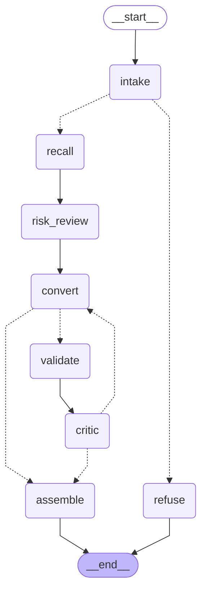

# 🚧 Selenium2Playwright — work in progress

**An AI agent that converts TypeScript Selenium test suites to Playwright** — a single test, a page object, or the whole suite — built on LangGraph + Claude, with a self-correcting loop that validates its own output before you ever see it.

> **Status: building in public.** Phases 0-9 complete, **Phase 10 complete**, Phase 11 underway ([the twelve hard cases are now a benchmark](docs/hard-cases.md)) (deployed, converting in the cloud, behind auth and a dollar budget, with a [Streamlit playground](docs/playground.md) in front of it and a feedback flywheel behind it) — **bounded reflection is working**. The graph converts, validates, and reviews code, then repairs it using the actual findings, for at most three conversion attempts (configurable down to one for evaluation). Assembly always reports the outcome and retains the latest available draft. A live seeded demo repaired a missing `await` on attempt 2: all four gates and the critic passed, while two locator TODOs correctly kept the final status at `needs-review`. See the [reflection walkthrough and demo](docs/reflection-loop.md).
> Architecture & decisions: [plan.md](plan.md)
> **In one line:** the agent checks and fixes its own work, and I measured that this self-correction lifts a cheap model from 2 of 12 correct conversions to 9 of 12, while a strong model rarely needs it, so the cost of AI review is spent only where it earns its keep.
>
> Complete: **Phase 6.4 — an independent judge for style.** An `openevals` LLM-as-judge scores each converted file 1–5 on a written rubric (user-facing locators, web-first assertions, POM/test shape) and was calibrated before use: all 12 goldens scored 5, all 24 deliberately broken goldens scored lower, and 24 of 24 repeat pairs agreed, with two different judge models. Scoring the six saved experiments showed what the exact gates cannot: Haiku files that compile, lint, and keep parity but still port `By.id` as CSS and return text for tests to assert on (3/5), and Opus first drafts that the internal critic rejected but both judges rated near-perfect (4.9 and 4.6) — reflection lifted Haiku's style and slightly lowered Opus's. Two judges agreed exactly on 81% of rows and within one point on 100%. [Report](docs/phase-6.4-report.md) · [theory + calibration](docs/evaluation-judge.md) · gap [T11](docs/gap-log.md): the Anthropic judge lost ~40% of replies to a provider-side cut; GPT-5.4 lost none.
>
> Complete: **Phase 6.5 — does the repair loop earn its extra calls?** The 6.3 A/B (one attempt vs up to three; only the attempt cap changes) was run per actor with the same Opus critic, on the same 12 pinned files, all arms verified in LangSmith.
>
> 
>
> **Haiku:** 2/12 → 9/12 fully passed, 8 files repaired, every compile failure fixed, ×1.9 cost. **Sonnet:** 11/12 → 10/12, nothing static to fix, one critic-variance swing. **Opus:** 6/12 → 11/12, 2 real repairs, 4 variance rows. Reflection earns its cost when first drafts are often wrong; when they are already clean it mostly re-argues the critic, and the Opus critic is the bill. Sonnet alone matches Opus-with-reflection at about half the price. [One-page explanation](docs/reflection-shootout.md); numbers in [reflection-shootout-table.md](docs/reflection-shootout-table.md); walkthroughs: [Haiku](docs/reflection-haiku-ab.md), [Opus](docs/reflection-ab.md); reports: [Haiku](docs/phase-6.5-haiku-report.md), [Sonnet](docs/phase-6.5-sonnet-report.md), [Opus](docs/phase-6.3-report.md). All 301 offline tests pass.
>
> Complete: **Phase 7.1 — a conversion is now a conversation.** A SQLite checkpointer gives every run a `thread_id`, so a second turn can be one sentence: `--thread login --refine "use getByTestId for every form field"` — no file path, no previous output, nothing re-pasted. Standing instructions accumulate on the thread and travel with *every* later model call, including repair laps, so the loop can't quietly undo your convention; the critic sees them too, so it reviews against your rule instead of flagging it. In the live two-turn run the agent applied the rule to the three fields that had ids and **refused to invent one** for the submit button that had none — keeping the faithful CSS locator with a `TODO(review)` saying why. Your instruction wins on style, never on truth. [Walkthrough + live diff](docs/short-term-memory.md). [Session restart notes](docs/session-handoff.md).
>
> Complete: **Phase 7.2 — the agent asks before it guesses.** Four gates and a critic catch code that is *wrong*; nothing catches code that is merely *not what you meant*. A deterministic detector flags the three Selenium patterns with more than one correct Playwright translation — browser dialogs, injected `executeScript`, and a session shared across tests by a `before` hook — and the graph calls LangGraph's `interrupt()` to **suspend itself mid-run** and ask, before spending a token on a guess. Your answer resumes the thread (`Command(resume=...)`), goes to the actor *and* the critic, and is remembered for every later turn. Live proof: the same alerts page converted twice, same model, differing only in the answer — `handler-first` produced `page.once("dialog", ...)` registered before the click, `expect-event` produced `Promise.all([waitForEvent("dialog"), click()])`; 30 lines differ, both passed 4/4 gates and the critic, and the first needed a repair lap because a synchronous dialog handler cannot await. [Walkthrough + live diff](docs/human-in-the-loop.md).
>
> Complete: **Phase 7.3 — teach it once, not once per conversation.** A thread remembers what you said in *that* conversation; the next file starts blank. So preferences now live in a LangGraph **store** of their own — keyed by user, not by thread — and each run recalls only the few that matter for the file in front of it, ranked by an embeddings model against a distilled profile of that file. Live proof: a rule taught while converting a page object on one thread (*"in test specs, wrap each action in a named test.step() block"*) was applied by itself two conversations later to an upload spec, in a fresh thread, with nothing typed — 25 lines different from the identical control run, both passing four gates and the critic on the first attempt. Three other remembered preferences correctly stayed behind, including one about the CI pipeline. The recall threshold was **measured, not guessed** ([calibration](docs/long-term-memory.md#5-calibrating-the-number-nobody-can-guess)): the naive "paste the file in" query separated nothing, and the biggest single factor turned out to be how a preference is *worded*. [Walkthrough + live diff](docs/long-term-memory.md). **Phase 7 complete.**
>
> Complete: **Phase 8.1 — the agent has a front door.** Everything above was reachable only as `python -m selenium2playwright.graph <file> --sixteen --flags`, with the whole front end living at the bottom of the graph module. It is now `s2p`, a real command on your PATH: `s2p convert <file>`, plus `s2p remember`, `s2p memories`, `s2p forget` and `s2p threads` — because teaching the agent a preference was never a kind of conversion. Typer builds the parser from the function signature (so `--max-attempts 9` is refused before a file is opened), and rich prints the result as a scorecard — the four gates, the critic, and the open-TODO count in one grid, with the reason on its own line — followed by a syntax-highlighted before/after diff. On a refine turn that diff is against the *previous turn*, not the source. `graph.py` lost 300 lines and is now only the graph. stdout is still exactly the converted file, so `s2p convert x.ts > x.spec.ts` still works. [Walkthrough](docs/cli.md).
>
> Complete: **Phase 8.2 — pick the model when you run it, and get the answer as data.** The model used to be a fact about the machine (`S2P_MODEL` in `.env`, the same until you edited the file). Now it is a fact about the *run*: `s2p convert page.ts --model opus`, or `--model haiku --critic-model opus` for a cheap actor with a strong reviewer — aliases for convenience, any `provider:model` string accepted, and a named model whose key is missing is refused before the first token instead of after a minute. The mechanism matters more than the flag: these settings travel as LangGraph **context**, the per-invocation channel, not as graph state — so on turn 2 of a saved thread the flag you just typed wins over what turn 1 recorded, which is the opposite of what putting it in state would have done. `--json` puts the whole outcome on stdout as one versioned document — scorecard, findings, ledger, token counts, the models that ran, and the converted code inside it — so a refusal is still something a caller can parse. Verified beyond Anthropic, too: the same graph converts with an OpenAI actor and an Anthropic critic in one run (4/4 gates + critic pass), a machine whose only key is OpenAI is told the one line that fixes it *before* the run instead of failing on authentication halfway through, a provider whose package is missing tells you the one line to add, and the critic's one Anthropic-specific output setting moved out of the graph so any provider works. [Walkthrough](docs/config.md). **Phase 8 complete.**
>
> Complete: **Phase 9.1 — read the whole folder before converting any of it.** Suite mode starts here, and it starts with no model at all. `s2p scan samples/selenium-suite` walks the tree, decides what each file *is* — page object, test, plain helper, or something outside the MVP — and prints the **order**: a topological sort of the import graph, shown as *waves*. The sample suite comes back as two waves, six page objects then the six specs that import them, because a spec converted before its page object is a spec written against something that does not exist yet. The point of a wave rather than a flat order is that nothing inside one depends on anything else inside it — which is the licence step 9.2 needs to fan the whole wave out in parallel with LangGraph's `Send`. The scan also splits a distinction single-file mode never had to make: a data helper with no browser code in it gets `unsupported` from the classifier and **copy** from the scanner, because in a folder "nothing to convert" is not a refusal. Cycles, files that leave the folder, and already-Playwright files are all named out loud with their reason instead of being dropped. `--json` emits the manifest as one versioned document; same folder in, byte-identical plan out. [Walkthrough](docs/suite-scan.md).
>
> Complete: **Phase 9.2 — a whole folder at once, in parallel, in one trace.** 9.1 produced the plan; `s2p suite samples/selenium-suite --out out/9.2` runs it. Every file in a wave is dispatched at the same instant with LangGraph's **`Send`** — a conditional edge that returns a *list of branches* instead of one node name, so the width of the fan-out is decided at run time by the import graph rather than written into the wiring — and each branch invokes the same Phase 0–8 graph `s2p convert` uses, nested under one parent run. The parallel branches all write to one state key, which LangGraph refuses by default; a **reducer** (`Annotated[list, operator.add]`) is what turns "one value per step" into "append them all", and it is the join half of the fan-out. Live proof, six real files, three at a time: **69.7s wall clock for 111.1s of work**, wave 1's three page objects starting within **8ms** of each other and wave 2's three specs starting **24ms** after the slowest of them finished — each spec converted against the *converted* page object, read from the output tree, not the Selenium original. A file that needs review is still written, because the next wave imports it; a branch that crashes becomes one failed row instead of taking eleven good conversions down with it. [Walkthrough](docs/suite-fanout.md).
>
> Complete: **Phase 9.3 — the folder, checked as one thing, with a report you can hand over.** 🏁 **M4 shipped.** Twelve green rows are twelve *local* claims: each file compiled on its own, against the companions it happened to import. A page object whose method two different specs call with different arguments passes every per-file gate and still leaves you a folder that does not build. So when the last wave finishes, the `finish` node compiles the **delivered tree as one project**, and exit 0 now needs both things — every file passed *and* the tree holds together. On top of that it writes three ledgers nobody had before: an aggregate scorecard, a **parity ledger** that puts every source file's public API next to what came back (kept / renamed / removed, quoting the model's own reason for a removal and saying **no reason given** when there is none), and the **consolidated TODO(review) list**, de-duplicated — a spec that was handed its converted page object reports the page object's TODO as its own, so one task was appearing twice. Live, all twelve sample files, four at a time: **83.1s, the tree compiles, 20 public names kept, 8 renamed, 0 removed** — and all eight renames are the same idiom shift, `getResultText` → `resultMessage`. The whole assembly costs 0.63s of the 83. Nothing in this step calls a model: it is evidence, which is exactly why it is allowed to contradict the rows above it. [The report it produced](docs/phase-9.3-report.md) · [walkthrough](docs/suite-report.md).
>
> Complete: **Phase 10.1 — the same graph, now behind a server.** Everything above was reachable only by typing `s2p` on the machine the code is on. `uv run langgraph dev` starts the LangGraph Platform server — the same server that runs in the cloud — reads `langgraph.json`, and publishes **both** graphs over HTTP, so LangGraph Studio can run a conversion node by node, pause it on a risky pattern and answer the question in the browser, and read the state that went into any step. **Not one line of the graph changed for this**, which is the point: the platform brings the checkpointer and the store and injects them at run time, and 7.1/7.3's optional `= None` parameters are what made that a no-change deploy. What did have to change was the *description* of the graph, and it has sharper corners than it looks — a factory whose parameters are unannotated is either rejected at start-up or, worse, handed a config object where its store belongs, silently. The step also found a real bug that no test could have: the platform wraps its store in a batching adapter with no `index_config`, so the check that decides whether memories can be ranked by meaning answered *no*, and semantic recall would have quietly degraded to "the three most recent" with nothing on fire. Verified live over HTTP: a conversion (4/4 gates + critic, 6 honest TODOs), a two-wave suite run with the whole tree compiled and the report written, a thread interrupt returning the dialogs question, and a remembered preference reaching the graph at a real similarity score. [Walkthrough](docs/local-platform.md).
>
> Complete: **Phase 10.2 — deploying it, and what that costs you honestly.** A graph whose only input is a *file path* cannot be deployed: a server in a data centre has none of your files. So the graph now takes the file as **text** (`source_text`, plus the filename as a name — the classifier, the memory query and the report all wanted the name, never the location), which is the input a paste box, an HTTP client or a browser can actually send; it is capped at 256 KB, and an over-long paste refuses through the same door a Cypress file does rather than crashing. The harder half was the part that is easy to skip: **the four gates are not string analysis** — they shell out to a pinned TypeScript compiler, a pinned ESLint and two AST scripts, and the deployment base image is Python with no Node in it at all. Shipping without them would still have returned converted files; it would just have stopped the deployment being able to *say* they compile, which is the entire claim this project makes. So the image builds the same pinned toolchain into itself, and the whole thing was proven against the **real deployment image on the real stack** — `langgraph build`, then Postgres and Redis and the container — where a file sent as text came back with 4/4 gates and the critic passing and one honest locator TODO, every gate having run `tsc` inside the container. Then it was deployed for real, and the managed platform could not host it — six revisions, no hostname, a bug in their serverless tier rather than in this image, written up in full because the write-up is the useful artifact. So it is **self-hosted instead**: three machines on Fly — this image, a `pgvector/pgvector:pg16` we are superuser on, and `redis:6` — for about $19.50/month, brought up by one script. The same file that failed six times managed converts through it with all four gates green and the critic passing, reflection loop and all, and semantic recall works there because on our own database `CREATE EXTENSION vector` simply succeeds. The URL is deliberately not published yet: the server has no authentication, so an open address is an open budget, and that is 10.4's job. [Walkthrough](docs/deploy.md), [self-hosting notes](deploy/fly/README.md).
>
> 🗺️ **[Interactive architecture diagram](https://claude.ai/code/artifact/877b27e1-3cc2-4f84-802f-091419bf27c1)** — the whole system on one page: the pipeline, the reflection loop, memory, evals, and the v2 AgentCore path. *(Source: [docs/architecture.html](docs/architecture.html))*

## The thesis

Migrating a Selenium suite to Playwright is mechanical enough to automate, but risky enough that "an LLM rewrote it" isn't good enough. So this agent is built on one rule: **the model can't lie to the compiler.** Every conversion must pass deterministic gates — `tsc --noEmit`, typed ESLint, a Selenium-residue scan, and structure parity (the converted suite keeps the same test cases and assertion coverage as the original) — and a critic loop repairs what fails, re-running up to 3 times before anything reaches you. Whatever can't be verified ships as an explicit `TODO(review)`, never silently.

## The graph today

Generated from the compiled graph with `build_graph().get_graph().draw_mermaid()`. Dotted edges choose the next node: intake reviews or refuses; the critic requests another conversion or assembly. A failed conversion also goes to assembly, preserving any earlier draft. The three-attempt limit is enforced by the graph's routing. `recall` fetches the handful of preferences you have taught it that matter for this file; `risk_review` is where the graph stops to ask you about a pattern with more than one correct conversion — it suspends the run rather than guessing.

Try it: `uv run s2p convert samples/selenium-suite/pages/LoginPage.ts` prints a scorecard and a before/after diff to stderr and the converted TypeScript to stdout (`--out <file>` writes it instead; `--no-diff` drops the diff). Add `--thread <id>` to save the conversation, then refine it later with `s2p convert --thread <id> --refine "…"` and nothing else; a threaded run also pauses to ask about risky patterns (`--answer dialogs=auto-dismiss` answers up front, `--no-ask` never asks). `s2p remember "…"` files a preference that applies to *every* future conversation (`s2p memories` lists them, `s2p forget <key>` drops one, `--no-recall` ignores them); `s2p threads` lists saved conversations. `--model opus` (or `haiku`, `sonnet`, `fable`, or any `provider:model`) picks the model for that run, `--critic-model` the reviewer, and `--json` returns the whole outcome — code included — as one document on stdout. A run permits up to three conversion and three critic invocations. Exit codes: 0 = all gates and critic pass with no open TODOs, 1 = `needs-review`, 2 = unsupported input or invalid CLI arguments. See the [CLI walkthrough](docs/cli.md), the [companion-file example](docs/validation-node.md#run-a-conversion), or run the [seeded reflection demo](docs/reflection-loop.md#live-demo).

Or run it as a server: `uv run langgraph dev` publishes both graphs (single file and whole suite) on `http://127.0.0.1:2024` and opens LangGraph Studio, where you can step through a conversion node by node and answer its questions in the browser. See the [local platform walkthrough](docs/local-platform.md) Or run the real deployment image — `uv run langgraph build -t s2p:dev` then `uv run langgraph up --image s2p:dev`, which brings up the container with Postgres and Redis — and call it with `uv run python scripts/call_deployment.py <file.ts>`, which reads the file here and sends the text there. See the [deployment walkthrough](docs/deploy.md).

## Why an agent — and not just Claude in a repo?

Fair question: Claude in a chat can convert a Selenium file. The difference is what you can trust *unattended*:

| | Claude in a chat / repo | This agent |
|---|---|---|
| **Verification** | you review everything by hand | output must pass compile, lint, residue and parity gates; a critic loop repairs failures (up to 3 passes) *before you see the code* |
| **Parity** | test cases or assertions can silently vanish in translation | test count and assertion coverage are checked against the source suite — a mismatch triggers self-correction, never a silent drop |
| **Quality** | depends on that day's prompt — vibes | scored on a fixed eval dataset (compile-pass %, residue rate, judge score) with a CI gate against regressions |
| **Scale** | file-by-file babysitting | whole suites: page objects first, then tests, converted in parallel |
| **Reusability** | requires prompting skill | CLI + playground — same result for anyone, including a CI pipeline |

For a one-off file, Claude in a repo is genuinely fine. An agent earns its existence when the job is **repeated, large, or needs guarantees** — and closing the gap from "the model can do it in chat" to "a system you can trust unattended" is exactly the engineering this project demonstrates.

## What's coming

- [x] Architecture + phased roadmap
> Complete: **Step 11.1b — scoring the hard cases, and changing the rulebook because of it.** The benchmark said what the converter is bad at, in its own words. Two page objects came back with the Selenium machinery *preserved* rather than removed: one kept `scrollIntoView` before every click, the other rebuilt Selenium's single frame cursor inside Playwright — a `currentFrame` field, a guard that throws, `enterTopFrame`/`returnToTop` intact. The playbook had twenty-five rules about locators, waits, actions and page objects, and **nothing at all** about `executeScript` or frames. Two new rules later, measured rather than argued: `AddRemovePage` dropped the workaround and passed on the first attempt; `NestedFramesPage` lost its cursor and came back as two `frameLocator` chains. One row regressed with the same disease through another door (`waitForFunction` with a `document` body), so the rule was completed to cover every browser-side callback. **Graph-passed rows: 6/11 → 9/11 for $1.57 across four runs.** The comparison that produced that number refuses to run unless every configuration key matches except the file hashes, and among those only `docs/playbook.md` moved — "we changed the prompt and the score went up" is a checkable claim here, not a story. **The most useful result is a negative one:** two *identical* baseline runs disagreed on four of eleven rows, so an eleven-row single-run A/B cannot attribute a small delta to a prompt edit at all — which is why the argument rests on reading the generated code, and why hard case 10 is still openly unsolved. Ran on OpenAI `gpt-5.4`, not Opus, because the Anthropic account hit a usage limit mid-step; the numbers sit beside the Phase 6 figures, not in place of them. [Report](docs/phase-11.1b-report.md).

> Complete: **Step 11.1a — the twelve hard cases, as a second benchmark.** The first eval set measures ordinary page objects and tests, and the converter passes it — but the ordinary cases are the ones where a careful translation is also the obvious one. `plan-review.md` listed twelve patterns where a *mechanical* translation compiles, passes lint, passes the residue scan, and silently tests something else: a `BasePage` of hand-rolled wait helpers whose correct conversion is to **delete almost the whole file**; an implicit wait whose removal turns a patient absence check into a race; a `stalenessOf` wait with no Playwright equivalent; a delete-all loop that goes stale halfway through if you snapshot it; a `before` hook that logs in once and leaves two tests silently order-dependent. Those twelve are now a benchmark: a second sample pair (11 Selenium files, 11 independently authored goldens), both suites green in a real browser — 7/7 and 7/7 — with all four gates passing over the golden tree, uploaded as 11 rows and verified by versioned readback. Two of the twelve were already covered by the first set and are cross-referenced rather than duplicated, and the build **fails** if any case is claimed by both benchmarks or by neither. One golden deliberately carries a `TODO(review)`: a dataset whose references never admit a limitation teaches the agent to guess confidently. Nothing here scores the converter — this step builds the ruler; 11.1b uses it and publishes the failures. [Walkthrough](docs/hard-cases.md).

> Complete: **Phase 10.4 — the guardrails that make a public URL safe to hand out.** After 10.2 the deployment answered everybody: `curl -X POST https://s2p.fly.dev/threads` returned 200 with no token. That is fine for a private experiment and it is not a link you put on a CV — for three problems that look like one and are not. **Money:** Fly's bill is a constant, but every conversion is real tokens on a real card, and an endpoint anyone can POST to is an endpoint anyone can spend from. **Files:** the convert graph reads `source_path` *on the server* when no text came with it, which is right on your laptop and is file disclosure on a public host — `{"source_path": "/etc/passwd"}` was a valid request, and the suite graph's entire input is server-side directories. **Everyone else's memory:** long-term memory is shared, so one visitor sending `remember: "always use xpath"` would quietly degrade every later conversion for everybody, with nothing on fire. So the platform's two separate questions get two separate answers — `@auth.authenticate` for *who is this* and `@auth.on...` for *may they do that* — with an owner key that can do everything and a demo key that is metered, inline-text-only and confined to its own memories. The budget is set in **dollars** because that is the unit the card is billed in, and enforced in runs because a run has to be allowed before the model answers and the price is only known after. A 👎 does not just get recorded: the input gets queued as an unreviewed dataset row, because the moment a real visitor says a real file came out wrong is the most valuable signal this project can collect. Five bugs that only running it could find — custom routes are **not** covered by the auth middleware, a synchronous LangSmith client in an async handler blocks the event loop, route docstrings are parsed as OpenAPI YAML, and `EXPIRE ... NX` is Redis 7+ while the deployment runs redis:6, which made a limiter that refused *everything* look exactly like a limiter that worked; and `langgraph-sdk` sends `x-api-key` rather than `Authorization`, so the guard turned away the project's own client until it learned both spellings. [Walkthrough](docs/guardrails.md).

> Complete: **Phase 10.3 — the playground: a paste box in front of the agent.** Steps 10.2 and 10.4 put the converter on the internet and made the URL safe to hand out; neither made it *visible* — a person who opens `https://s2p.fly.dev` sees `{"detail":"Not Found"}`. Now there is a page: six one-click samples from the real sample suite, a paste box, the reflection loop narrating itself as it goes ("Converting to Playwright — attempt 2"), the four gates as PASS/FAIL, a diff, the consolidated TODO ledger, a Download button, 👍/👎, and a plain-English "Ask for a change" that runs a second turn on the same thread. It calls the deployment as a *visitor* — the demo key, never the owner key, which would bypass the meter — with a per-session visitor header so the fairness limits count people; the key never reaches the browser. The layout lives in `ui/app.py` and every decision in `playground.py`, because Streamlit re-runs the whole script on each click, which makes the app file impossible to unit-test and the split mandatory: 57 tests, one of which runs step 10.4's real authorization handler over the request the page builds. Three bugs only running it could find: a spec pasted *alone* cannot compile (it imports a page object the server has never seen — the finding was correct and was about the paste box, not the conversion, hence the companion file box); a 👎 comment typed and clicked without pressing Enter was sent empty, because Streamlit commits a text input on blur or Enter; and the sidebar budget line lied by one until the page re-ran after each conversion. [Walkthrough + screenshot](docs/playground.md).

- [x] **M0** — one-prompt conversion, traced end-to-end in LangSmith
- [x] **M1** — LangGraph pipeline: classify → convert (with honest refusals)
- [x] **M2** — deterministic validators + reflection loop
- [x] **Evals** — 12 pinned files, four exact gates + a calibrated LLM judge. Sonnet, one attempt: 12/12 static, 11/12 graph, judge 4.4/5 at $0.29; Haiku needs the repair loop (2→9/12); Opus first drafts judge 4.9/5. Details in [phase-6.4-report.md](docs/phase-6.4-report.md) and [reflection-shootout.md](docs/reflection-shootout.md). A second benchmark covers [the twelve SDET hard cases](docs/hard-cases.md) — 11 browser-verified rows; scoring them produced [two new playbook rules and 6/11 → 9/11](docs/phase-11.1b-report.md)
- [x] **M3** — conversation memory ([threads + checkpointer](docs/short-term-memory.md)) + [human-in-the-loop for risky patterns](docs/human-in-the-loop.md) + [long-term memory across conversations](docs/long-term-memory.md)
- [x] **M3.5** — the `s2p` command line: [convert, scorecard, diff](docs/cli.md) + [runtime `--model` and `--json`](docs/config.md)
- [x] **M4** — whole-suite conversion: [scan and order](docs/suite-scan.md) → [parallel fan-out](docs/suite-fanout.md) → [one report](docs/suite-report.md); 12 files in 83.1s, the tree compiles as one project
- [x] **M5** — a playground you can try: the agent is [deployed](deploy/fly/README.md), [guarded](docs/guardrails.md), and now has a [paste box in front of it](docs/playground.md) *(the page runs locally against the live deployment; hosting the page itself is part of the launch kit in 11.3)*

**Stack:** Python · LangGraph · LangSmith · any LangChain chat model — Claude by default, OpenAI verified end to end, swappable per run with `--model` or in `.env` via `S2P_MODEL` · TypeScript toolchain as the referee

---

*Built in public by [Varun Bhatt](https://github.com/varunbhatt2193).*
