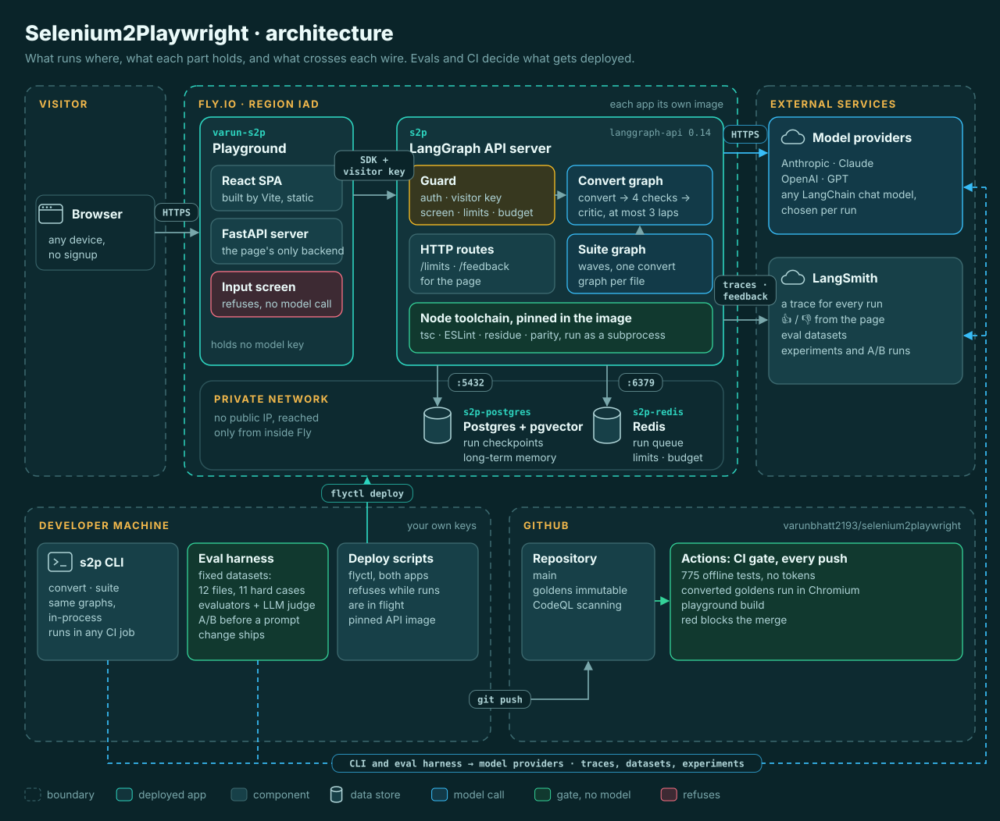

# Selenium2Playwright

**An AI agent that rewrites TypeScript Selenium test suites in Playwright, and proves the result compiles before you see it.**

[](https://github.com/varunbhatt2193/selenium2playwright/actions/workflows/ci.yml)

## ▶ Try it — [varun-s2p.fly.dev](https://varun-s2p.fly.dev)

No signup, nothing to install. Paste one file, or drop a zip of your whole Selenium folder and get a Playwright folder back. The front page has a four-minute demo if you would rather watch first.

[](https://varun-s2p.fly.dev)

<table>
<tr><th>You give it Selenium</th><th>You get back Playwright</th></tr>
<tr>
<td>

```ts
await driver.findElement(By.id('email')).sendKeys('me@example.com');
await driver.findElement(By.css('button[type=submit]')).click();
await driver.wait(until.urlContains('/home'), 5000);
```

</td>
<td>

```ts
await page.locator('#email').fill('me@example.com');
await page.locator('button[type=submit]').click();
await expect(page).toHaveURL(/\/home/);
```

</td>
</tr>
</table>

## What makes it an agent, not a prompt

- **The model can't lie to the compiler.** Every conversion must pass four deterministic gates: `tsc --noEmit`, typed ESLint, a Selenium-residue scan, and structure parity (same test cases, same assertion coverage as the source).
- **It fixes its own work.** An AI critic reviews the output and the graph repairs what failed, up to three attempts, before anything reaches you. Whatever can't be verified ships as an explicit `TODO(review)`, never silently.
- **It converts whole suites.** Page objects first, then the specs that import them, in parallel, and then the delivered tree is compiled as one project with a parity ledger you can hand over.
- **It asks before it guesses.** Three Selenium patterns have more than one correct Playwright translation (dialogs, `executeScript`, a session shared by a `before` hook). The run suspends and asks you, then remembers the answer.
- **It learns your conventions.** Tell it once ("wrap each action in a named `test.step()`") and it applies that rule in later conversations, on the files where it matters.
- **It doesn't take orders from the file.** A pasted file that isn't Selenium, or that carries text aimed at the model (in a comment, a string, look-alike letters or invisible characters), is refused before any model sees it. The model is told the file is data, and a conversion that loads anything its source never did fails parity.

## Measured, not claimed

| What was measured | Result |
|---|---|
| The 12-file sample suite, converted as one upload | **12/12 passed**, tree compiles as one project, about 20 seconds |
| Does self-correction earn its cost? (12 pinned files, same critic) | Haiku **2/12 → 9/12**; Opus **6/12 → 11/12**; Sonnet 11/12 first try |
| Style, scored by a calibrated LLM judge | Two judges agreed within one point on **100%** of rows |
| The twelve SDET hard cases, as a second benchmark | **6/11 → 9/11** after two playbook rules, with the delta proven from the code |
| Converted tests run in a real browser, in CI, with no model spend | **20/20** test rows pass when the page object interface is supplied |
| Offline test suite | **775 tests**, on every push, no secrets and no tokens |

Full numbers and how they were produced: [Evaluation primer](docs/evaluation-primer.md) · [live evaluation page](https://varun-s2p.fly.dev/evaluation) · [what is still unsolved](docs/hard-cases.md).

## Why not just Claude Code in the repo?

Fair question. Claude Code can convert a Selenium file, and for one file it does it well. The difference is what you can trust when nobody reviews every file: when the migration is repeated, large, or has to be right.

| | Claude Code in the repo | This agent |
|---|---|---|
| **Checking the output** | Runs tsc or the linter when it decides to, and decides for itself when it is done. | Compile, lint, residue and parity checks run on every attempt. They are steps in the graph, not a choice the model makes. A failure goes back with its findings, at most three times, before you see any code. |
| **Tests that go missing** | A test or an assertion can vanish in translation and the file still compiles. Someone has to notice. | Test and assertion counts are compared with the source. A mismatch sends the file back for repair, never a silent drop. So does any import the source never had. |
| **Quality** | Depends on the prompt and the day. Nobody measures it. | Scored on a fixed evaluation set, with a CI gate against regressions. A prompt change ships only after an A/B run on that set. |
| **Scale** | File by file, with someone watching each one. | A whole suite from one zip: page objects first, then the tests that use them, compiled together as one project. |
| **Who can run it** | Someone with prompting skill and access to the repo. | Anyone, with the same result: the playground, the CLI, or a CI pipeline. |
| **What reaches the model** | Whatever is in the files, including text written to steer the model. | Anything that is not Selenium, or that talks to the model, is refused before a model sees it. Every run is metered against a budget. |

For a one-off file, Claude Code in the repo is genuinely fine. An agent earns its place when the job is **repeated, large, or needs guarantees**. Closing the gap between "the model can do it" and "a system you can trust unattended" is the engineering this project is about.

## How it works

[](ui/web/public/architecture.svg)

A LangGraph state machine. Before it starts, a pasted file is screened: anything that is not Selenium, or that talks to the model, is refused without a model call. `intake` classifies the file or refuses it honestly. `recall` fetches the few remembered preferences that apply. `risk_review` pauses the run on a pattern with more than one right answer. `convert` writes Playwright, `validate` runs the four gates, `critic` reviews, and the graph loops back with the actual findings until it passes or the attempt cap is hit. `assemble` always reports the outcome and keeps the latest draft. Suite mode wraps the same graph in a scan, a parallel fan-out per wave, and a whole-tree compile.

**Stack:** Python · LangGraph · LangSmith · any LangChain chat model (Claude by default, OpenAI verified end to end, swappable per run with `--model`) · pinned TypeScript toolchain as the referee · React + Vite playground over FastAPI, self-hosted on Fly behind auth and a dollar budget.

[Architecture and decisions](plan.md) · [Build log, phase by phase](docs/build-log.md)

## Run it yourself

```sh
uv sync
cp .env.example .env            # add ANTHROPIC_API_KEY (or OPENAI_API_KEY + S2P_MODEL=openai:gpt-5.4)
uv run s2p convert samples/selenium-suite/pages/LoginPage.ts
uv run s2p suite samples/selenium-suite --out out/suite
```

`s2p convert` prints a scorecard and a before/after diff, and writes the converted TypeScript to stdout. `s2p suite` converts a folder and writes the report beside it. Add `--model haiku --critic-model opus` for a cheap actor with a strong reviewer, `--json` for the whole outcome as one document, or `uv run langgraph dev` to step through a run in LangGraph Studio. [CLI walkthrough](docs/cli.md) · [playground walkthrough](docs/playground.md) · [deployment](docs/deploy.md).

---

*Built in public by [Varun Bhatt](https://github.com/varunbhatt2193). The demo is metered per visitor and against a shared daily dollar budget, because every conversion is real tokens on a real card. The page shows how many are left today.*
