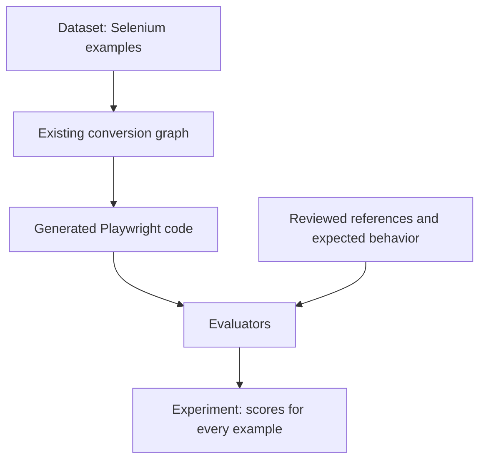

# AI evaluations — theory and code before Phase 6

Lesson delivered on 2026-09-05 before Phase 6 implementation started. The user
has since confirmed readiness; the first 6.1 increment and its review point are
in [evaluation-dataset.md](evaluation-dataset.md). These introductory snippets
remain teaching examples, not an installed evaluation runner. Continue from
the [restart notes](session-handoff.md).

An AI evaluation measures how well our application performs across a collection
of tasks. For this project: how often does Selenium become useful, correct
Playwright code, and how much does the repair loop help?

The application being measured includes the model, prompt, context, validators,
and repair loop. A prompt change might improve login conversions while breaking
iframes; a repeatable collection of examples helps reveal that regression.

| Evaluation term | Testing equivalent | Our project |
|---|---|---|
| Dataset | Test collection | Selenium examples across different scenarios |
| Example | One case | One file plus its required context |
| Reference output | Reviewed expected result | Independent golden Playwright code |
| Target | System under test | The existing conversion graph |
| Evaluator | Checking function | Does the generated code compile? |
| Experiment | One execution of the collection | Outputs and scores for one configuration |



The reference is available to the evaluator. The converter receives only context
that would legitimately be available during the task, not its own expected answer.
References are optional for checks such as compilation. See the official
[evaluation concepts](https://docs.langchain.com/langsmith/evaluation-concepts)
and [quickstart](https://docs.langchain.com/langsmith/evaluation-quickstart).

## What the existing checks establish

| Check | A passing result establishes | Still uncertain |
|---|---|---|
| Compile | TypeScript accepts the generated files | Browser behavior |
| Residue | Our rules find no forbidden Selenium patterns | Preserved behavior |
| Lint | Configured lint rules pass | Whether the test achieves its purpose |
| Parity | No loss detected in tracked tests/assertions | Whether assertions check the right behavior |
| Browser execution, later | Tests pass in the tested environment | Untested conditions |

`await page.goto("/wrong-page")` can compile. Therefore, a 100% compile score
cannot establish complete correctness. Our seeded 5.2 demo also passed all four
gates and the critic after repair, but correctly retained `needs-review` because
two locator TODOs remained.

The critic works **inside** a conversion and can request another draft. An
evaluation measures results **across** conversions. Existing offline tests use
scripted model replies to check graph behavior; real-model experiments measure
the quality that behavior achieves. Evals complement those tests.

## One dataset example

This teaching example uses paths relative to the repository root:

```python
from pathlib import Path

example = {
    "inputs": {
        "source_path": "samples/selenium-suite/pages/LoginPage.ts",
    },
    "outputs": {
        "code": Path(
            "samples/playwright-golden/pages/LoginPage.ts"
        ).read_text(encoding="utf-8"),
    },
    "metadata": {"scenario": "login", "kind": "page-object"},
}
```

`example["outputs"]` holds the expected answer. The target returns the actual
answer. Evaluators receive those as `reference_outputs` and `outputs`, respectively.
The reusable dataset should snapshot source and required companion contents so
later changes to local files do not silently change the examples.

## One evaluator using code we already have

```python
from selenium2playwright.validators.compile import compile_check


def compiles(outputs):
    code = outputs.get("code", "")
    if not code.strip():
        return {"key": "compiles", "score": 0}

    report = compile_check({"pages/LoginPage.ts": code})
    return {"key": "compiles", "score": int(report.passed)}
```

`outputs` is the target's output dictionary. Empty code earns zero. `compile_check`
runs the real TypeScript compiler; `int(True)` is 1 and `int(False)` is 0. `key`
names the metric. No model is needed to grade this property. LangSmith recognizes
the argument name `outputs`; see its
[code evaluator API guide](https://docs.langchain.com/langsmith/code-evaluator-sdk).

The implementation already exists in
[validators/compile.py](../src/selenium2playwright/validators/compile.py).
This teaching wrapper handles a standalone LoginPage only; the full evaluator
must include companion imports and explicit handling of unavailable tools.

The following demonstration was executed locally on 2026-09-05:

```python
golden = example["outputs"]["code"]
print(compiles({"code": golden}))
print(compiles({"code": golden.replace(".fill(", ".fil(", 1)}))
print(compiles({"code": ""}))
```

```text
{'key': 'compiles', 'score': 1}
{'key': 'compiles', 'score': 0}
{'key': 'compiles', 'score': 0}
```

The second candidate deliberately calls nonexistent `.fil()`. Known good and
known bad examples help verify that the evaluator itself works. This was a local
compiler demonstration, with no live model calls or cloud experiment.

## Connect the existing graph to the evaluator

```python
from selenium2playwright.graph import build_graph
from selenium2playwright.reflection import MAX_ATTEMPTS

graph = build_graph()


def target(inputs):
    final_state = graph.invoke(
        inputs,
        config={"recursion_limit": 3 * MAX_ATTEMPTS + 5},
    )
    report = final_state.get("report")
    result = report.result if report else None
    return {
        "code": result.code if result else "",
        "status": report.status if report else final_state["status"],
    }
```

This adapter accepts dataset inputs, runs the graph, and extracts the final
artifact. The graph still performs conversion, validation, critique, and allowed
repairs. Its code lives in [graph.py](../src/selenium2playwright/graph.py).

After step 6.1 creates a dataset named `s2p-v0` with inputs matching this adapter,
the basic experiment call would be:

```python
from langsmith import evaluate

results = evaluate(
    target,
    data="s2p-v0",
    evaluators=[compiles],
    experiment_prefix="reflection-v1",
    max_concurrency=1,
    num_repetitions=1,
)
```

This call has **not** been executed. The named dataset has not been created by
this lesson. It would make real model calls and record results in LangSmith.
`max_concurrency=1` processes one example at a time; `num_repetitions=1` runs each
once. The SDK sends inputs to the target and outputs to evaluators, then records
the results. See the official
[target function guide](https://docs.langchain.com/langsmith/define-target-function).
The installed LangSmith SDK inspected for this lesson was version 0.12.1.

## Understand the numbers before comparing versions

Illustrative scores `1, 1, 0, 1, 1` yield `4 / 5 * 100 = 80%` compile success.
This describes those five outputs, not the probability that every future suite
will work. Inspect failed scenarios as well as the average. Retain failures and
tool errors explicitly; silently dropping them makes scores misleading.

For the reflection comparison, use the same dataset version, model, prompt, and
tool configuration with one attempt versus up to three total attempts. Compare
quality together with time and token usage. Repeated runs help assess variation;
keep some examples aside from prompt tuning to check whether changes generalize.
The current graph hardcodes `MAX_ATTEMPTS = 3`; a configurable baseline is still
future work, not an existing `max_iterations` parameter.

Later, an LLM judge can score idiomatic quality using a clear rubric, such as
locator evidence and web-first assertions. Calibrate that judgment against human
reviews. A judge's opinion cannot establish correct browser execution. Golden
code should guide expected behavior, not force exact string equality: equivalent
implementations can use different names or structure.

## Implementation sequence and current position

Step 6.1 is dataset curation: roughly five POMs and eight tests spanning login,
alerts, iframe, windows, upload, and dynamic loading. First define the behavior
each case must preserve and the context it may use. Write independent reviewed
goldens, then prepare the upload script. Completion means the dataset is visible
in LangSmith. Step 6.2 adds evaluator functions and the first scored experiment;
6.3 compares reflection, 6.4 adds a calibrated judge, and 6.5 compares models.

Step 6.1 is now complete: 12 curated examples are uploaded and verified in
LangSmith. See the [completion report](phase-6.1-report.md). The examples earlier
in this primer remain teaching snippets; they are not a scored experiment.
Detailed theory before code and explanatory comments remain required. Follow
[the restart notes](session-handoff.md) for Step 6.2; do not automatically advance
through later phases.
