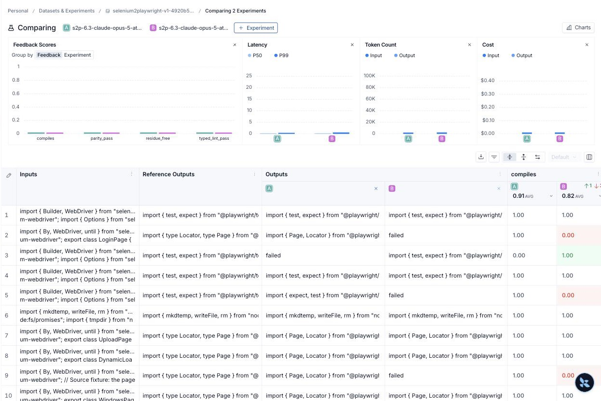

# Phase 6.3 — one attempt vs. reflection, measured

Phase 6.3 is complete. The same pinned 12-example dataset was converted twice at
one clean code revision with one difference: arm A allowed **one** conversion
attempt, arm B allowed **up to three** (draft + two repairs, the production
default). Plain-English walkthrough: [reflection-ab.md](reflection-ab.md).

**Headline numbers (all 12 scheduled rows in the denominator):**

| Metric | A: one attempt | B: reflection | Delta |
| --- | --- | --- | --- |
| All four static gates passed | 11/12 (91.67%) | 9/12 (75.0%) | −2 |
| Graph report `passed` | 9/12 (75.0%) | 8/12 (66.67%) | −1 |
| Actor tokens (all rows) | 51,327 | 62,347 | +11,020 (×1.215) |
| Actor model calls | 12 | 14 | +2 |
| Target wall-clock (sum of rows) | 172.48 s | 173.35 s | +0.87 s (×1.005) |

Taken alone, that table says reflection made things worse. It did not. Read on.

## What actually happened

Every "regressed" row in arm B, and the one failure in arm A, failed the same
way: the actor's structured reply put `notes` as a **string** instead of a
**list**, Pydantic rejected it, the conversion node recorded an error, and the
graph's conversion-error edge went straight to `assemble`. No validation, no
critic, and no repair lap ran for those rows. This is the same failure seen once
in the 6.2 baseline (WindowsPage). It hit 1 of 12 first drafts in arm A and
3 of 12 in arm B. Same model, same prompt, same schema: the rate is noise
between runs, roughly one to three files in twelve.

| Case | A: one attempt | B: reflection | What it means |
| --- | --- | --- | --- |
| alerts-page | needs-review, critic asked for a revision, no budget | **no draft** (parse failure) | B never got a chance |
| dynamic-loading-page | needs-review, critic asked for a revision, no budget | **passed on attempt 2** | reflection fixed it |
| iframe-test | **no draft** (parse failure) | passed (1) | A never got a chance |
| login-page | passed (1) | **no draft** (parse failure) | B never got a chance |
| windows-page | passed (1) | needs-review after 2 attempts, all gates pass, 1 TODO | first draft varied; repair passed the gates |
| windows-test | passed (1) | **no draft** (parse failure) | B never got a chance |
| six other rows | passed (1) | passed (1) | reflection never fired |

**Only the rows where the model produced a draft** (the rows reflection could act on):

| Measure | A: one attempt | B: reflection |
| --- | --- | --- |
| rows with a draft | 11 | 9 |
| all four gates passed | 11/11 | 9/9 |
| graph report passed | 9/11 (81.8%) | 8/9 (88.9%) |
| rows that used a repair lap | 0 | 2 |

So the honest reading is three sentences. First, when the first draft parses,
Opus passes all four static gates on the first try in every case we have, so the
repair loop has almost nothing to repair at the static level. Second, where the
critic asked for a revision, reflection turned one needs-review into a pass and
cost two extra actor calls and about 11k extra actor tokens. Third, the biggest
quality lever in this pipeline is not reflection at all: it is the structured
output parse failure that the loop does not cover, because a parse failure on
attempt 1 is routed to assembly instead of being retried.

## The number that replaces "perfect"

Across the 6.2 baseline and both 6.3 arms (36 first attempts at one revision
family, same model and prompt): **31 of 36 first drafts parsed, and 31 of 31
parsed drafts passed all four static gates.** Five of 36 first drafts (13.9%)
failed to parse and produced no code. Per run that is 9 to 11 files out of 12
passing all static checks. "Perfect" is not a word this project uses anymore.

## What was held fixed

| Setting | Recorded value |
| --- | --- |
| Dataset | `selenium2playwright-v1-4920b5f319d8`, ID `33c80b1e-96bd-4b5b-a9c1-ca49d215828f` |
| Pinned dataset version | `2026-09-06T03:05:09.476354+00:00` |
| Collection SHA-256 | `4920b5f319d827a25a3d8f1a2f026c430e1fb20bdb897c6b9c3599f55b8aeb3d` |
| Model (actor and critic) | `anthropic:claude-opus-5`; 8,192 output tokens; critic effort medium |
| Code revision | `653ba6df0df7a5c4331fba8ba76ef67e79f63799`, clean worktree for both arms |
| Evaluators | `deterministic-v1` (compile, residue, typed lint, parity) |
| Concurrency / repetitions | 1 / 1 |

| Arm | Experiment | ID | Configuration SHA-256 |
| --- | --- | --- | --- |
| A: one attempt | [`s2p-6.3-claude-opus-5-attempts1-d75f27de`](https://smith.langchain.com/o/32ac11b4-3e72-4765-a59b-5dc1bcd32cbe/datasets/33c80b1e-96bd-4b5b-a9c1-ca49d215828f/compare?selectedSessions=a8fead0a-b63c-4b38-ad34-18f9c5474d2e) | `a8fead0a-b63c-4b38-ad34-18f9c5474d2e` | `c4865e53506125211715934d836636a8530341ff27870aa621f537598bb04cc5` |
| B: reflection | [`s2p-6.3-claude-opus-5-attempts3-3c890967`](https://smith.langchain.com/o/32ac11b4-3e72-4765-a59b-5dc1bcd32cbe/datasets/33c80b1e-96bd-4b5b-a9c1-ca49d215828f/compare?selectedSessions=e4b095f6-f29e-4dc6-9c47-ee211014e7be) | `e4b095f6-f29e-4dc6-9c47-ee211014e7be` | `2e8e284cfac4c5df377d32f9b04e2825f87d9a6a535989008aa58730a65a8f93` |

The two configuration hashes differ only in `max_attempts`; the comparison code
checks every other key and reports `comparable: true`. Both arms have complete
local evidence and verified LangSmith readback (12 roots, 96 feedback each).

[Side-by-side view of both experiments in LangSmith](https://smith.langchain.com/o/32ac11b4-3e72-4765-a59b-5dc1bcd32cbe/datasets/33c80b1e-96bd-4b5b-a9c1-ca49d215828f/compare?selectedSessions=a8fead0a-b63c-4b38-ad34-18f9c5474d2e,e4b095f6-f29e-4dc6-9c47-ee211014e7be).

The UI averages (`0.91` for A, `0.82` for B on `compiles`) again disagree with
the verified row counts (11/12 and 9/12): the UI drops a row from its
denominator. Quote the verified counts, not the UI summary, as in 6.2.

## Time, tokens, cost

| Measure | A: one attempt | B: reflection |
| --- | --- | --- |
| Experiment wall-clock | 174.5 s | 174.2 s |
| Target seconds (sum) | 172.48 | 173.35 |
| Actor tokens | 51,327 (12/12 rows) | 62,347 (12/12 rows) |
| Critic tokens | 52,792 known over 11 rows; 1 missing | 51,465 known over 9 rows; 3 missing |
| LangSmith root cost | $0.464905 known over 11 rows; 1 missing | $0.419288 known over 9 rows; 3 missing |

Critic tokens and cost are missing exactly on the no-draft rows: no critic call
happened there, and readback excludes a row's cost when local and cloud token
totals cannot be matched. Total cost for either arm is therefore unavailable,
and the known subtotals are not comparable because they cover different rows.
Wall-clock is nearly equal because the no-draft rows in B were fast failures
that offset its two repair laps.

## What this does not prove

- Static gates do not establish browser correctness.
- One run per arm. With a 1-to-3-in-12 parse failure rate, a one- or two-file
  delta is inside run-to-run noise. Repeated runs would be needed to size the
  reflection effect properly.
- Arm A still ran the critic, so it is not the cheapest possible pipeline.
- Both arms used golden POMs as context for test rows.

## Recommended next increment (not done here)

Make the first-attempt parse failure repairable: either coerce a string `notes`
into a one-item list in the schema, or use the JSON-schema structured-output
method for the actor as the critic already does, or route a conversion error on
attempt 1 back into `convert` while budget remains. Each is a converter change,
so under the project rule it needs its own green evaluation run. The A/B harness
built in this step is how that run gets measured. This is recorded in
[gap-log.md](gap-log.md).

## Evidence

- Tracked: [phase-6.3-comparison.json](phase-6.3-comparison.json) (every number
  above, per row), [phase-6.3-delta.jpg](phase-6.3-delta.jpg).
- Local, ignored: `out/6.3/ab-20260906T081429Z-8a59b789/` with `attempts-1/` and
  `attempts-3/` (plan, journal, report, cloud readback), `comparison.md`,
  and `out/6.3/completion-offline-tests.txt`.
- The comparison was regenerated with `--compare-only` after a reporting-only
  change to `eval_compare.py` (the "rows with a draft" breakdown). No model was
  re-run and no score changed.
