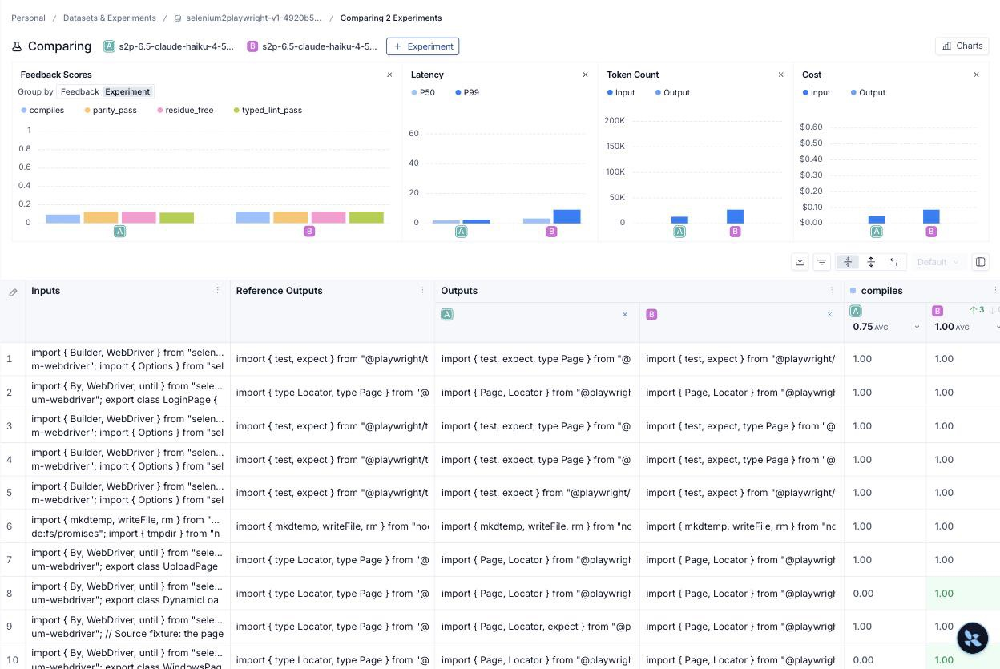

# Phase 6.5 (part 1) — reflection with a weak actor: Haiku writes, Opus reviews

The phase 6.3 A/B asked "does the repair loop help?" with Opus as the actor.
The answer was small because Opus's first drafts already passed every static
gate. This run repeats the identical A/B with a weak actor
(`anthropic:claude-haiku-4-5-20251001`) and the same strong critic
(`anthropic:claude-opus-5`) in both arms. Plain-English walkthrough:
[reflection-haiku-ab.md](reflection-haiku-ab.md).

Prerequisite change (commit `1c8edad`): a separate `S2P_CRITIC_MODEL`
setting, resolved in `llm.py`, hashed into the plan configuration as
`critic_model`, checked by `run_experiment` before any model call, and named
in the experiment prefix when it differs from the actor.

## The result

Code revision `1c8edad6323104ad93a88d538d6e0c79df03e902`, clean worktree,
both arms complete locally and verified in LangSmith (12 roots, 96 feedback
each). Only `max_attempts` differs between the arms; the comparison reports
`comparable: true`.

| Metric | A: Haiku, one attempt | B: Haiku, reflection | Delta |
| --- | --- | --- | --- |
| compiles | 9/12 | 12/12 | +3 |
| typed_lint_pass | 11/12 | 12/12 | +1 |
| residue_free, parity_pass | 12/12 | 12/12 | 0 |
| All four static gates passed | 9/12 (75%) | **12/12 (100%)** | +3 |
| Graph report `passed` | 2/12 (16.7%) | **9/12 (75%)** | +7 |
| Rows that used a repair lap | 0 | 8 (5 used two attempts, 3 used three) | +8 |
| Actor model calls | 12 | 23 | +11 |
| Actor tokens | 42,510 | 95,328 | +52,818 (×2.24) |
| Critic tokens (Opus) | 62,374 | 119,489 | +57,115 (×1.92) |
| Target wall-clock (sum) | 199.1 s | 391.5 s | +192.4 s (×1.97) |
| LangSmith root cost | $0.356964 (12/12) | $0.689008 (12/12) | +$0.33 (×1.93) |

Per case:

| Case | A: one attempt | B: reflection | Attribution |
| --- | --- | --- | --- |
| dynamic-loading-page | compile + lint fail, needs-review | gates pass on attempt 2, critic pass, 3 TODOs → needs-review | reflection fixed the code; a human still must look |
| iframe-page | compile fail, needs-review | gates pass on attempt 3, critic still revise, 3 TODOs → needs-review | reflection fixed the compile error, not the review |
| windows-page | compile fail, needs-review | **passed** on attempt 2 | reflection |
| iframe-test, login-page, upload-page | gates pass, critic revise | **passed** on attempt 2 | reflection |
| windows-test | gates pass, critic revise | **passed** on attempt 3 | reflection |
| alerts-page | gates pass, critic revise | 3 attempts, critic still revise, 2 TODOs | reflection ran out of budget |
| dynamic-loading-test, upload-test | needs-review | passed on attempt 1 | run-to-run variance |
| alerts-test, login-test | passed | passed | never fired |

Change counts from the comparison: `improved` 7, `improved without repair
(variance)` 2, `same` 3, `regressed` 0.

## The three-way view

| Metric | Haiku alone | Haiku + reflection | Opus alone | Opus + reflection |
| --- | --- | --- | --- | --- |
| All four static gates passed | 9/12 | 12/12 | 12/12 | 12/12 |
| Graph report `passed` | 2/12 | 9/12 | 6/12 | 11/12 |
| Rows that used a repair lap | 0 | 8 | 0 | 2 |
| Actor calls | 12 | 23 | 12 | 14 |
| Actor tokens | 42,510 | 95,328 | 50,860 | 63,139 |
| Critic tokens (Opus in all four) | 62,374 | 119,489 | 57,831 | 66,795 |
| Wall-clock (sum) | 199 s | 391 s | 184 s | 211 s |
| LangSmith root cost | $0.357 | $0.689 | $0.515 | $0.541 known over 11 rows |

Opus columns: phase 6.3 run 2 ([phase-6.3-report.md](phase-6.3-report.md)),
same dataset version, collection hash, and evaluators, revision `c9459f2`.

**Reading.** Reflection turns Haiku from 2/12 into 9/12 fully passed reports
and removes every compile failure; that is more fully passed reports than
Opus without the loop (6/12). It does not reach Opus with the loop (11/12),
and it is not cheaper, because the Opus critic runs once per lap and the
Haiku arm needed 23 laps against Opus's 14. On this dataset the cheapest
route to the best result is still Opus with reflection.

## What was held fixed

| Setting | Recorded value |
| --- | --- |
| Dataset | `selenium2playwright-v1-4920b5f319d8`, ID `33c80b1e-96bd-4b5b-a9c1-ca49d215828f` |
| Pinned dataset version | `2026-09-06T03:05:09.476354+00:00` |
| Collection SHA-256 | `4920b5f319d827a25a3d8f1a2f026c430e1fb20bdb897c6b9c3599f55b8aeb3d` |
| Actor | `anthropic:claude-haiku-4-5-20251001`; 8,192 output tokens |
| Critic | `anthropic:claude-opus-5`; effort medium; JSON-schema output |
| Evaluators | `deterministic-v1` (compile, residue, typed lint, parity) |
| Concurrency / repetitions | 1 / 1 |

| Arm | Experiment | ID | Configuration SHA-256 |
| --- | --- | --- | --- |
| A: one attempt | [`s2p-6.5-claude-haiku-4-5-20251001-critic-claude-opus-5-attempts1-cd1eedf0`](https://smith.langchain.com/o/32ac11b4-3e72-4765-a59b-5dc1bcd32cbe/datasets/33c80b1e-96bd-4b5b-a9c1-ca49d215828f/compare?selectedSessions=5cbc2e15-0208-494f-9fe8-9827faa72319) | `5cbc2e15-0208-494f-9fe8-9827faa72319` | `d84e5faee58d1ebd2c7509b92dffa9a00f0591a115c49f09471792902aca84d3` |
| B: reflection | [`s2p-6.5-claude-haiku-4-5-20251001-critic-claude-opus-5-attempts3-6b251c97`](https://smith.langchain.com/o/32ac11b4-3e72-4765-a59b-5dc1bcd32cbe/datasets/33c80b1e-96bd-4b5b-a9c1-ca49d215828f/compare?selectedSessions=332774ac-fe8f-4358-baa2-ae8aee0a74aa) | `332774ac-fe8f-4358-baa2-ae8aee0a74aa` | `61ea0ba1b2f53da53741cb47bfbcc5a0a5c95c65679723f92352dc0925b2322c` |

[Side-by-side view of both experiments in LangSmith](https://smith.langchain.com/o/32ac11b4-3e72-4765-a59b-5dc1bcd32cbe/datasets/33c80b1e-96bd-4b5b-a9c1-ca49d215828f/compare?selectedSessions=5cbc2e15-0208-494f-9fe8-9827faa72319,332774ac-fe8f-4358-baa2-ae8aee0a74aa).

## Discarded first attempt

An earlier live run at the same revision (arm A experiment
`e931ca7e-6f65-4d78-bb0c-146ca266425d`) completed all 12 rows but was
rejected by the runner's post-execution check ("Configuration changed during
execution") because a documentation file was created in the worktree while
it ran, flipping `git_dirty`. It is not used anywhere above; its local
artifacts are kept, ignored, under
`out/6.5/discarded-dirty-worktree-ab-20260906T085156Z-1b8daf8f/`. Its numbers
(all-static 8/12, graph passed 3/12) are consistent with the clean arm A.

## What this does not prove

- Static gates plus the critic's verdict, not a browser run.
- One run per arm; two rows moved without a repair, which is the size of
  the critic's run-to-run variance on this dataset.
- No Haiku-critic arm was run, so "Haiku end to end" is not measured here.
  It would change actor and critic at once, which the comparison forbids.

## Evidence

- Tracked: [phase-6.5-haiku-comparison.json](phase-6.5-haiku-comparison.json)
  (every number per row), [phase-6.5-haiku-delta.jpg](phase-6.5-haiku-delta.jpg).
- Local, ignored: `out/6.5/ab-20260906T085549Z-5764b5b4/` with `attempts-1/`,
  `attempts-3/` (plan, journal, report, cloud readback), `comparison.md`,
  and `run.log`.
