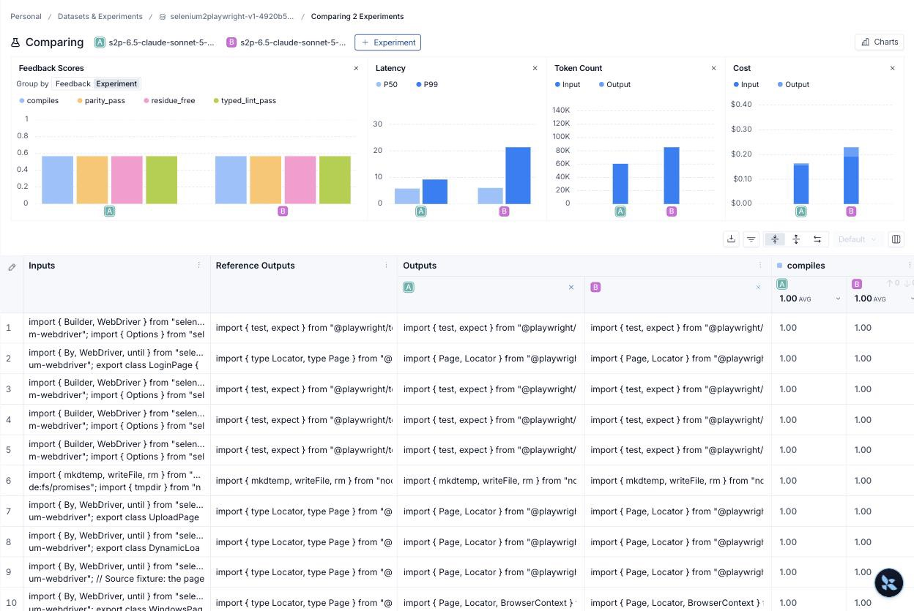

# Phase 6.5 (part 2) — Sonnet writes, Opus reviews

Same A/B as the [Haiku run](phase-6.5-haiku-report.md) with
`anthropic:claude-sonnet-5` as the actor and `anthropic:claude-opus-5` as the
critic in both arms. Only `max_attempts` differs (1 vs 3). Revision
`52256a9`, clean worktree, pinned dataset version
`2026-09-06T03:05:09.476354+00:00`, both arms complete locally and verified
in LangSmith (12 roots, 96 feedback each), `comparable: true`.

## The result

| Metric | A: Sonnet, one attempt | B: Sonnet, reflection | Delta |
| --- | --- | --- | --- |
| All four static gates passed | 12/12 | 12/12 | 0 |
| Graph report `passed` | 11/12 (91.7%) | 10/12 (83.3%) | −1 |
| Rows that used a repair lap | 0 | 3 (2 used two attempts, 1 used three) | +3 |
| Actor model calls | 12 | 16 | +4 |
| Actor tokens | 50,844 | 74,396 | +23,552 (×1.46) |
| Critic tokens (Opus) | 55,688 | 75,976 | +20,288 (×1.36) |
| Target wall-clock (sum) | 142.0 s | 209.0 s | +67.0 s (×1.47) |
| LangSmith root cost | $0.289290 (12/12) | $0.404408 (12/12) | +$0.12 (×1.40) |

Per case (the other nine rows passed on attempt 1 in both arms):

| Case | A: one attempt | B: reflection | Attribution |
| --- | --- | --- | --- |
| iframe-page | passed | critic revise on attempt 1, **passed** on attempt 2 | critic variance triggered a lap; the lap ended clean |
| windows-page | needs-review (critic revise) | attempt 2: gates + critic pass, 2 `TODO(review)` → needs-review | reflection fixed the review; the ledger correctly keeps a human in |
| login-page | passed | critic revise on attempt 1; attempt 3 passes gates + critic, 3 `TODO(review)` → needs-review | labelled `regressed`; see below |

**Reading.** Sonnet's first drafts are as clean as Opus's: every one passed
all four static gates and the critic accepted eleven of twelve. The loop
fired on three rows. It never fixed a static failure because there were
none; what it did was follow the critic's revision requests, and the repaired
drafts came back with explicit `TODO(review)` notes on the locator choices
(`#username` kept as CSS because the source gave no accessible name). Under
the report rules a TODO means "needs review", so the fully-passed count went
down by one even though the code did not get worse. That row is the same
critic-variance effect seen in 6.3: with one attempt the critic passed the
draft, with three it asked for a revision on an equivalent draft.

Compared with the other actors ([three-way table](reflection-shootout-table.md)):
Sonnet alone (11/12) already matches Opus with reflection (11/12) at about
half the cost ($0.29 vs ≥$0.54), and reflection adds cost without adding
passes. On this dataset Sonnet is the cheapest actor that does not need the
loop.

## What was held fixed

| Setting | Recorded value |
| --- | --- |
| Dataset | `selenium2playwright-v1-4920b5f319d8`, ID `33c80b1e-96bd-4b5b-a9c1-ca49d215828f` |
| Collection SHA-256 | `4920b5f319d827a25a3d8f1a2f026c430e1fb20bdb897c6b9c3599f55b8aeb3d` |
| Actor / critic | `anthropic:claude-sonnet-5` / `anthropic:claude-opus-5` (effort medium) |
| Evaluators | `deterministic-v1`; concurrency 1; repetitions 1 |

| Arm | Experiment | ID | Configuration SHA-256 |
| --- | --- | --- | --- |
| A: one attempt | [`s2p-6.5-claude-sonnet-5-critic-claude-opus-5-attempts1-10e199aa`](https://smith.langchain.com/o/32ac11b4-3e72-4765-a59b-5dc1bcd32cbe/datasets/33c80b1e-96bd-4b5b-a9c1-ca49d215828f/compare?selectedSessions=5773296b-6650-4850-a5a3-8d716adc5e1e) | `5773296b-6650-4850-a5a3-8d716adc5e1e` | `8453e3f3c714faade58f0afd34d111584f1b3721ca4ef4c380bb77c52b3353c0` |
| B: reflection | [`s2p-6.5-claude-sonnet-5-critic-claude-opus-5-attempts3-58d0a7f4`](https://smith.langchain.com/o/32ac11b4-3e72-4765-a59b-5dc1bcd32cbe/datasets/33c80b1e-96bd-4b5b-a9c1-ca49d215828f/compare?selectedSessions=fedf9a3c-ac1a-4316-a8df-11fd6c94563a) | `fedf9a3c-ac1a-4316-a8df-11fd6c94563a` | `e072d908c650d1a6641dc32308b3072c31e85cdedc76b6aa29d533c73ea9f3c3` |

[Side-by-side in LangSmith](https://smith.langchain.com/o/32ac11b4-3e72-4765-a59b-5dc1bcd32cbe/datasets/33c80b1e-96bd-4b5b-a9c1-ca49d215828f/compare?selectedSessions=5773296b-6650-4850-a5a3-8d716adc5e1e,fedf9a3c-ac1a-4316-a8df-11fd6c94563a).

## Two earlier attempts, both discarded

1. **Credits ran out** (revision `c48e5f6`, arm A `facf5bdd-…`, arm B
   `fc93d48b-…`). Two arm-B rows got `Error code: 400 … credit balance is
   too low`. The comparison at the time called it comparable; gap **T10**
   ([gap-log.md](gap-log.md)) made `eval_compare` refuse arms with provider
   errors. Receipt kept as
   [phase-6.5-sonnet-comparison-invalid.json](phase-6.5-sonnet-comparison-invalid.json).
2. **Mac slept mid-run** (revision `52256a9`, arm A `fdf45f0d-…` verified,
   arm B `bd57f0ac-…` stalled after row 3 with no open socket and 5 s of CPU
   over 6.7 h). Killed. The successful run was started under `caffeinate -i -s`.
   Artifacts: `out/6.5/discarded-hung-after-sleep-ab-20260906T162853Z-72be586f/`.

Both arm-A results from those attempts (12/12 static; 9/12 and 10/12
passed) sit inside the spread of the valid run; none are used above.

## What this does not prove

- Static gates plus the critic's verdict, not a browser run.
- One run per arm; the `login-page` swing is one row of critic variance.
- No Sonnet-critic arm; the critic is Opus everywhere by design.

## Evidence

- Tracked: [phase-6.5-sonnet-comparison.json](phase-6.5-sonnet-comparison.json),
  [phase-6.5-sonnet-delta.jpg](phase-6.5-sonnet-delta.jpg).
- Local, ignored: `out/6.5/ab-20260906T231129Z-98298800/` (plan, journal,
  report, cloud readback per arm, `comparison.md`, `run.log`).
