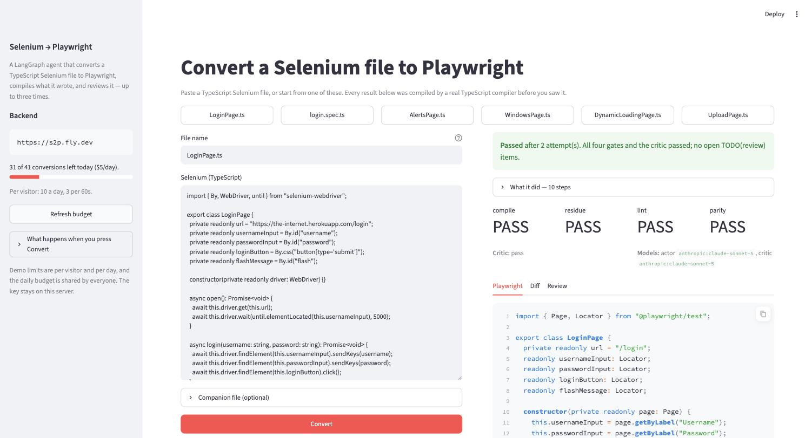

# The playground: the page in front of the agent

> **The page is React now (2026-09-08).** What follows this box is the original
> step 10.3 walkthrough of the Streamlit page, kept because the reasoning in it —
> visitor key, companion file, the two bugs only running it could find — is all
> still true. The Streamlit file still runs locally (`uv run --group ui streamlit
> run ui/app.py`) and is the only way to convert a folder **by path**. The
> deployed page at **[varun-s2p.fly.dev](https://varun-s2p.fly.dev)** is the
> React one described here.

## The React page

```bash
cd ui/web && npm ci && npm run build          # once, and after any change to ui/web
uv run --group ui uvicorn ui.server:app --port 8501
```

Or, for development with hot reload, `npm run dev` in `ui/web` serves the page on
:5173 and proxies `/api` to the uvicorn server on :8501.

Three pieces, and the split matters for the same reason it did with Streamlit:

| piece | what it is | tested by |
|---|---|---|
| `ui/web` | the page: React + Vite + TypeScript, one theme, no UI framework | your eyes |
| `ui/server.py` | seven FastAPI routes translating the page's requests into `playground.py` calls | `tests/test_web.py`, 19 tests |
| `src/selenium2playwright/playground.py` | every decision — unchanged | `tests/test_playground.py` |

`ui/server.py` holds no logic. It validates a visitor id, calls the same
`playground` functions the Streamlit page called, and turns the result into
JSON. The one new idea is **server-sent events**: `POST /api/convert` and
`POST /api/suite/convert` answer with a stream of `data: {json}` lines — a
`run` event carrying the run id, a `node` event per graph node with the same
translated label the Streamlit page printed ("Converting to Playwright — attempt
2"), and a final `done` event carrying the scorecard, the diff and the download
name. The page reads that stream with `fetch` (EventSource cannot POST) and
draws the agent trace as it arrives, which is the most interesting thing on the
page: you watch the reflection loop go round.

What the page shows, top to bottom:

1. **Hero** — the sample suite's real numbers (12/12, ~20s) and the live budget
   line from `GET /limits`, so the page says what is left before anyone spends it.
2. **Live conversion** — six sample chips from the real suite, an editable
   Selenium pane, a Playwright pane with syntax colour, a diff, and the
   scorecard: a ring of gates passed, each gate PASS/FAIL with a one-line
   explanation, the critic's verdict, which models did the work, the agent
   trace, the TODO(review) ledger, Download and Copy, "Ask for a change" (a
   second turn on the same thread) and 👍/👎.
3. **Whole suite** — drop a zip (or press "Use the 12-file sample suite"), see the
   wave plan and the price *before* the button, watch files tick off as they
   land, then the result: per-file table, the whole-tree compile, the parity
   ledger, every TODO, the report, and one button for the zip.
4. **How it works** — the pipeline, and links to the source, the playbook and the
   hard cases.

Things a demo should know:

- **The sample suite button reads `samples/selenium-suite` on the server** and
  sends it as `source_tree` like any upload, so it is metered like any upload:
  twelve conversions.
- **The visitor id is per browser tab** (`sessionStorage`), minted by the server
  and checked against `^pg-[0-9a-f]{12}$` on every request. Anything else in the
  header is replaced, never trusted.
- **Every refusal the guard would make is made first by the server with a 400
  and a sentence**, and once more by the page before the button — same rule,
  three places, so it arrives as a hint instead of a 403.
- The page is built inside the Docker image (`deploy/fly/Dockerfile.ui`, Node
  stage) and `ui/web/dist` is gitignored. A missing build answers `/` with a
  503 that says to run `npm run build`, never a stack trace.

---

# Step 10.3 — the playground: a paste box in front of the agent (the original Streamlit page)

Step 10.2 put the converter on the internet. Step 10.4 made the URL safe to hand
out. Neither made it *visible*: `https://s2p.fly.dev` is a JSON API, and a person
who opens it in a browser sees

```json
{"detail":"Not Found"}
```

Everything the last four phases built — the four gates, the reflection loop, the
critic, the consolidated TODO ledger — is real and completely invisible. This
step is the difference between "there is an agent deployed" and "here, try it".



```bash
uv run --group ui streamlit run ui/app.py
```

Two files, and the split between them is the first thing worth understanding.

| file | what it is | tested by |
|---|---|---|
| `ui/app.py` | the layout: what goes where on the page | your eyes |
| `src/selenium2playwright/playground.py` | every decision the page makes | `tests/test_playground.py`, 114 tests |

## Streamlit in five minutes, because the model explains the code

Streamlit is a way to write a web page as a Python script. There is no HTML, no
callbacks-and-state framework, no JavaScript. You write:

```python
name = st.text_input("Your name")
if st.button("Greet"):
    st.write(f"Hello {name}")
```

and you get a text box and a button. The part that surprises everybody, and the
part that shapes this whole step, is **what happens when you click**:

> Streamlit re-runs the entire script, top to bottom, on every single
> interaction.

Not a callback. Not a diff. The whole file, from line 1, every time. `st.button`
returns `True` on exactly the run that follows its click and `False` on every
other run. That model has three consequences here:

**1. Anything you want to keep must live in `st.session_state`.** Ordinary
variables are born and die on each run. `st.session_state` is a dictionary that
survives, per browser tab. That is where the last result, the thread id, the run
id and the visitor id live.

**2. A file that *is* the program cannot be unit-tested.** Importing `ui/app.py`
runs the app. So `ui/app.py` holds no logic at all: building the request,
reading the scorecard, formatting the diff, explaining an HTTP failure — all of
it is in `playground.py`, which is ordinary Python. One of the tests asserts
that `playground.py` never imports Streamlit, because the moment it does, none
of the others can be written.

**3. A widget's value is not committed the instant you type it.** `st.text_input`
sends its value when it loses focus or you press Enter. Type a comment, then
click the button next to it, and the script sees the *previous* value — nothing,
the first time. See "The two bugs only running it could find" below; the fix is
`st.form`, which submits every widget inside it together.

## What the page does

**Six sample buttons**, each a real file from `samples/selenium-suite`, with a
tooltip saying why that one is interesting (`AlertsPage.ts`: native dialogs, which
have no Playwright twin). A paste box in front of a stranger is a blank page; the
buttons are so somebody who has never written Selenium can still watch the thing
work in one click.

**A paste box and a file name.** The name is a *label*, not a path — see the
guardrail section.

**Live progress while it runs.** A conversion takes 30–90 seconds, and the graph
streams the name of each node as it finishes. Those names are translated
(`validate` → "Running the four gates: compile, residue, lint, parity") and, from
the second lap on, numbered ("Converting to Playwright — attempt 2"), because
watching the reflection loop go round is the most interesting thing on the page
and "convert, convert, convert" looks like a stuck progress bar.

**The scorecard**: status, attempt count, the four gates as PASS/FAIL, the
critic's verdict, and which models did the work. `needs-review` is shown as a
real outcome, not a failure.

**Three tabs**: the Playwright file (with a Download button), a unified diff
against what you pasted, and Review — the consolidated TODO(review) ledger, the
model's notes, and any errors.

**Ask for a change.** A second turn on the same thread: "Keep search() returning
the number of results, using count()." The graph still has the last draft and
every instruction given so far (step 7.1's short-term memory), so a refinement is
one sentence rather than a re-paste.

**👍 / 👎.** The score attaches to the run in LangSmith. A 👎 also sends the file
back, which is what `feedback.py` queues into the `s2p-feedback-queue` dataset —
the score is a number on a chart, but *the input somebody says we got wrong* is a
dataset row.

**A budget line in the sidebar**, read from `GET /limits` before anything is
submitted: "31 of 41 conversions left today ($5/day)." A demo that says how much
is left is a demo that looks maintained; the alternative is discovering the
budget by waiting a minute and being refused.

## The playground is a *visitor*, and that is the whole security story

It authenticates with `S2P_DEMO_KEY`, never `S2P_API_KEY`. The owner key bypasses
the meter, so a playground holding one would run the day's budget straight past
every guardrail step 10.4 built.

The key lives in the environment of the machine running Streamlit and never
reaches the browser. A person using the playground gets a URL, not a credential.

Everything the demo identity may not do, the playground simply never offers:

| step 10.4 refuses | the playground |
|---|---|
| `source_path` as a path | sends `source_text`; the name is a label, checked against the same bare-filename rule |
| `context_paths` | sends `context_text` — the companion's actual bytes |
| `output_path`, `remember`, suite runs | no such control exists on the page |
| `max_attempts` above 3 | never sent |
| files over 256 KB | refused under the text box, in KB, before the round trip |

Those client-side checks are not the playground being careful on its own
initiative — the server enforces all of it anyway. They exist so that a rule
arrives as a sentence under the input while it can still be fixed, instead of as
a 403 after the click. `tests/test_playground.py` runs the real `guard.guard_run`
handler over the request this module builds, which is the only test in the suite
that would notice the two halves drifting apart.

## Talking to the deployment

```python
client = get_sync_client(url=..., api_key=demo_key(), headers={"X-S2P-Visitor": visitor})
for chunk in client.runs.stream(thread_id, "convert", input=request,
                                stream_mode=["updates", "values"]):
```

`X-S2P-Visitor` is a random id per browser session. The per-visitor limits (3 a
minute, 10 a day) are meant to count *people*, and without this header every
visitor would look like one caller — the playground's own server address — and
the third person to arrive would be rate-limited by the first two.

The two stream modes are two views of the same run: `updates` names the node that
just finished (the progress line), `values` is the whole state after it (the
answer, once the last one arrives). A third event, `metadata`, arrives first and
carries the **run id** — which is how a 👎 clicked ninety seconds later knows
which run it is talking about.

`GET /limits` and `POST /feedback` are not part of the graph API, so they are
called with plain `httpx` and a `Bearer` token. They authenticate themselves
(`http_app.py`), which is the fifth bug of step 10.4 and worth re-reading.

## The three things only running it could find

**1. A spec pasted alone cannot compile, and it is nobody's fault.** The first
live run of `login.spec.ts` came back `needs-review` with `compile=FAIL`: the
spec imports `../pages/LoginPage`, and the server has never seen that file. The
finding was *correct* — and it was about the paste box, not about the
conversion, which is the worst kind of first impression. The fix is the
**companion file** box: an already-converted Playwright page object, sent as
`context_text`, exactly what the suite graph feeds every file in wave 2. The
`login.spec.ts` button now pre-fills it from `samples/playwright-golden`, and the
same run came back **passed, 4/4 gates, critic pass**.

**2. A typed comment was silently dropped.** The 👎 comment box and the 👎 button
were separate widgets, so a visitor who typed "the locator is wrong" and clicked
👎 without pressing Enter sent an *empty* comment — losing the only part of the
feedback with any detail in it, with no error and no way to notice. Both the
feedback box and the refine box are now `st.form`s, where every widget submits
together. Verified by typing a comment, not pressing Enter, clicking 👎, and
reading the row back out of LangSmith:

```
2026-09-07 23:34  LoginPage.ts | playground form check: comment typed without
                  pressing Enter | pg-73c5ad1bd1a4 | unreviewed
```

**3. The budget line lied by one.** The sidebar is drawn at the top of the
script, before the conversion the click starts — so after a run it still showed
the number from before it. A `st.rerun()` when the conversion finishes fixes it,
and gives the node trail somewhere permanent to live ("What it did — 10 steps"),
since the live status box belongs to the run that drew it.

A fourth, found while writing the tests rather than by running it:
`feedback.pending()` — the triage call — always returned an empty queue from a
shell, because `feedback.py` never loaded `.env` and so never had a LangSmith key
to build a client with. Inside the deployment the variable is already in the
environment, which is exactly why nobody noticed.

## Configuration

| variable | what it does |
|---|---|
| `LANGGRAPH_DEPLOYMENT_URL` | which backend to talk to; defaults to `http://127.0.0.1:8123` (a local `langgraph up`) |
| `S2P_DEMO_KEY` | the key the playground calls with. Falls back to `S2P_API_KEY` only for a local server running `S2P_AUTH=off` |
| `S2P_API_KEY` | used **only** by the whole-suite tab, and only when the backend is on this machine — `guard.guard_run` refuses `root` for anyone but the owner |

Both are already in `.env`, so `uv run --group ui streamlit run ui/app.py` talks
to the live deployment with no arguments. Point `LANGGRAPH_DEPLOYMENT_URL` at
`http://127.0.0.1:8123` to develop against a container on your desk instead;
nothing else changes, which is the same property `scripts/call_deployment.py`
has.

Streamlit is in an opt-in dependency group (`ui`), not in the project's
dependencies. `s2p convert` and the graph must never need a web framework
installed to convert a file.

## Live evidence, 2026-09-07, against <https://s2p.fly.dev>

| what | result |
|---|---|
| `LoginPage.ts` (sample button) | **passed**, 2 attempts, 4/4 gates + critic pass, no TODOs, `getByLabel("Username")` |
| `login.spec.ts` **without** its companion | needs-review, `compile=FAIL` on the unresolvable import — the finding that produced the companion box |
| `login.spec.ts` **with** the companion | **passed**, 2 attempts, 4/4 gates + critic pass |
| `AlertsPage.ts` | **passed**, 1 attempt, 4/4 + critic pass |
| a pasted `SearchPage.ts` (not a sample) | needs-review, 2 attempts, 4/4 + critic pass, one honest locator TODO |
| refine: "Keep search() returning the number of results, using count()" | second turn on the same thread → `async search(term): Promise<number> { … return this.results.count(); }`, 3 attempts, 4/4 + critic pass |
| 👎 with a comment | attached to the run **and** queued into `s2p-feedback-queue` with the comment and visitor id |
| the meter | budget line moved 38 → 31 across the session, one per conversion |

## The second tab: a whole folder

`s2p suite` has converted folders since step 9.3 — 12 files, dependency waves, a
whole-tree compile and a markdown report — and none of it was visible in the
browser. The tab is the surface, and the interesting part is *why it is only
half a surface*.

### Getting a suite in, and getting it back out

A paste box is the right input for "show me what this does to one file" and the
wrong one for everything else — nobody pastes twelve files. So there are two
ways in, and the difference between them is not convenience.

**Upload** sends the folder as `source_tree`: relative path to text, the same
keys the manifest already uses. Drop the `.ts` files, or a zip of the folder —
a zip is the one to prefer, because a browser does not send the directory a
loose file came from and a spec's `import '../pages/LoginPage'` needs those
directories to exist. `tree_from_zip` strips the wrapping folder (`selenium-suite/pages/…`
becomes `pages/…`) and drops `node_modules`, `__MACOSX` and friends rather than
refusing the upload over them.

**A folder path** sends `root`/`out_root`, which name directories on the machine
the graph runs on. That is offered only when the backend *is* this machine.

The way back out is a **zip of the converted tree with `conversion-report.md`
inside it**. One button, not two: the report is the document that says which of
those files still needs eyes, and the two parting company is how it gets ignored.

### The graph never learned about text, and did not need to

The suite graph's inputs are `root` and `out_root`; it walks the folder with
`Path.rglob`, copies support files with `shutil.copyfile`, and compiles a real
tree with a real `tsc`. Rewriting all of that to work on a dict would have
touched every part of steps 9.2 and 9.3.

It did not have to. `plan` **materializes** `source_tree` into a temp directory
it chooses, and `finish` reads the result back out as text and deletes the
workspace. Everything in between is the same code a folder run uses.

```python
if state.get("source_tree") and not state.get("root"):
    workspace = Path(tempfile.mkdtemp(prefix="s2p-suite-"))
    suite.materialize(state["source_tree"], workspace / "src")
```

Three things had to be true for that to be safe on a public host:

**No key may escape the workspace.** `suite.safe_path` is a whitelist of shapes,
not a blacklist of tricks: no absolute paths, no drive letters, no backslashes,
every segment `[A-Za-z0-9._-]` with no leading dot (which is how `..` is
excluded), at most 8 deep. A tree with one bad key is refused whole rather than
partially written — a suite that silently dropped a file would convert and
compile and be wrong in a way nobody would look for. It is checked in three
places, by the page, by the guard and by the graph, because each is the last
line of defence for a different caller.

**The workspace has to go, including when the run does not finish.** `finish`
deletes its own. A run that raises in between never reaches `finish`, so
`sweep_workspaces()` runs at the start of the next one and removes anything
older than an hour. A sweep rather than a background task: it needs no
scheduler, and the moment a new suite starts is exactly when an old one is
provably over.

**Twelve files have to cost twelve.** The meter counted *runs*, and a twelve-file
suite is one run and twelve conversions — so one request would have spent twelve
times its share of a budget everybody shares. `limits.spend(runs=n)` charges per
file, atomically (`INCRBY`, not a loop), so a suite that does not fit is refused
whole and refunded: "this needs 12 and 5 are left" is a better answer than half a
suite. Support files that are only copied are charged too — the guard cannot
classify them without doing the scan itself, and over-charging makes the demo
stop early, which is the direction to be wrong in.

### What is left that only works locally

**Naming a folder by path**, and nothing else. `root` and `out_root` are still
refused for anyone but the owner, and still should be — on a public host
`root: "/"` is a request to read the machine:

```python
# guard.py
"root": "belongs to the suite graph, which reads server-side directories",
"out_root": "belongs to the suite graph, which writes server-side directories",
```

`pg.folder_blocker()` gates that one input, and it deliberately asks about the
URL rather than reading a feature flag — the honest question is *whose
filesystem is this*, and the answer is in the address bar. Note what it is no
longer about: suites work everywhere; typing a path works on your own laptop.

```bash
uv run langgraph dev --no-browser --port 2024        # terminal 1
LANGGRAPH_DEPLOYMENT_URL=http://127.0.0.1:2024 \
  uv run --group ui streamlit run ui/app.py \
  --server.address 127.0.0.1                          # terminal 2
```

`--server.address 127.0.0.1` is not decoration. Streamlit binds `0.0.0.0` by
default and prints a Network URL, and this tab reads and writes folders on your
disk as you — so on an untrusted network, binding it to the world is handing
somebody a file browser.

### Two modes, two credentials, and the one that would cost money

`guard.guard_run` opens with `if _is_owner(ctx): return True` and refuses `root`
for everybody else. A local server started with auth *on* and both keys set
would hand the playground a **demo** identity — so the folder input would be
offered and then 403 by the same process that offered it, which is the worst of
both. Hence `pg.suite_key()` returning `S2P_API_KEY` **locally**.

The other half is the one that matters. Remotely it returns the *demo* key,
deliberately: an uploaded suite is metered per file, and the meter is only
reached on the demo path — the owner returns `True` before `limits.spend` is
called at all. A page that sent `S2P_API_KEY` to a public deployment would spend
the whole day's budget past every guardrail step 10.4 built. So the owner key is
scoped to the one case that needs it and cannot leak into the one that must not
have it. There is a test named after exactly that.

### Three things the single-file path did not need

**A plan, before the button.** A suite run is the one thing on this page that
costs twelve conversions instead of one, so `pg.plan_suite()` runs `suite.scan`
locally — no model, no server — and puts "12 files to convert in 2 waves · 0
copied across · 0 skipped" and the wave contents on screen *first*. It is only
correct because suite mode is local: the folder this process can see is the
folder the graph will open.

**A config on the run.** `max_concurrency` is what actually caps the fan-out —
without it LangGraph starts every `Send` in a wave at once, and a forty-file
wave opens forty connections to the provider. `recursion_limit` counts
super-steps and each wave costs two, so it grows with the suite. Both are
restated from `cli.suite_run_config` and pinned against it by a test, because
two copies of the recursion arithmetic is exactly the kind of thing that drifts
silently and then fails a forty-file suite at wave nine.

**Files ticking off as they land.** The fan-out finishes `convert_file` once per
file, in completion order, and each of those `updates` events carries the one
outcome that branch appended. `Update` gained an `update` field so `stream()`
stops throwing that payload away: for one conversion it is noise, for a suite it
is the difference between eighty seconds of visible work and eighty seconds of
spinner.

### What the result tabs are for

`Files` is step 9.2 — one row per file, in plan order rather than finish order.
Everything else is step 9.3's assembly, and `Tree` is the one worth reading
first:

> Every per-file verdict above is a claim about that file compiling against the
> companions it happened to import.

A page object whose `login()` two specs call with different argument counts
passes every row and still leaves a folder that does not build. `Tree` is the
converted folder compiled as **one project**, and it is why `result.passed`
requires both `every row green` *and* `the tree compiles` — a compile that could
not run is `NO`, never "fine".

`Parity` is what the source exposed publicly and what became of it; a removal
with no reason is the loudest line in the report. `TODOs` is every
`TODO(review)` in the suite merged into one list, so the same concern reported
by both a page object and its spec is one line rather than two.

### Gotchas found building it

**Everything arrives as a dict.** `FileOutcome` and `Assembly` are frozen
dataclasses in the graph and plain JSON by the time they reach the page — tuples
become lists, nested dataclasses become dicts. `pg._get()` reads either, so the
same reader works against a direct `invoke` in a test and against the SDK
stream; the alternative was two readers that drift.

**Both tabs render on every run.** Streamlit draws the tab you are not looking
at and hides it, so nothing in either may do work on sight. Everything expensive
stays behind a button, and the folder scan is the one exception — cheap, no
model, and the thing that makes the plan visible before you spend anything.

**A dict shadowed a dataclass and nobody would have noticed.** `suite_result`
built the converted files into a local called `tree`, then reassigned `tree` to
the whole-tree *compile report* forty lines later. The download button silently
offered a zip containing `{"gate": "compile", "passed": true}`. Caught by a test
that asserted the round trip, not by reading it.

**The owner key leaking into a remote call was the expensive bug.** It would
have worked perfectly and bypassed the meter entirely. The test is
`test_a_remote_upload_never_calls_as_the_owner`, and it is the one to keep.

**Recall is off by default here, where the CLI defaults it on.** A first suite
run should have the fewest moving parts: recall needs the server's embeddings
configured, and a page that fails on a store it never mentioned is a bad first
answer. The checkbox is right there.

### Live evidence, 2026-09-08, against a local `langgraph dev`

`samples/selenium-suite`, `--only LoginPage.ts, login.spec.ts`,
`openai:gpt-5.4`, 4 at a time, 3 attempts:

| what | result |
|---|---|
| the plan, before the button | 2 files in 2 waves — wave 1 `pages/LoginPage.ts`, wave 2 `tests/login.spec.ts` |
| `pages/LoginPage.ts` | **passed**, wave 1, 4/4 gates + critic pass, 2 attempts, 15.2s |
| `tests/login.spec.ts` | **passed**, wave 2, 4/4 gates + critic pass, **1 attempt**, 5.3s — it was handed the converted page object |
| the whole tree | **compiles** as one project |
| parity | 4 kept, 1 renamed (`LoginPage.getFlashText → LoginPage.flashMessage`, reason quoted from the model's own notes), 0 removed, 0 unexplained |
| TODOs | none |
| written | `out/playground-suite/{pages,tests}/*.ts` + `conversion-report.md`, rendered in the Report tab |
| total | 20.5s |

And the same two files **uploaded as a zip**, against the same local backend,
with no path in the request at all:

| what | result |
|---|---|
| the zip | `selenium-suite.zip`, 15 entries — the wrapper folder stripped, `pages/` and `tests/` kept |
| the plan, before the button | 12 files in 2 waves; narrowed to 2 by `--only` |
| the run | **2 passed**, tree compiles, 13.5s |
| back out | "Download the converted suite — 2 file(s) + the report" |
| the workspace | gone; `sweep_workspaces()` covers the runs that never reach `finish` |

## Where to look next

- [guardrails.md](guardrails.md) — the contract this page is the client half of.
- [deploy/fly/README.md](../deploy/fly/README.md) — the backend it talks to.
- [human-in-the-loop.md](human-in-the-loop.md) and
  [short-term-memory.md](short-term-memory.md) — what "Ask for a change" is
  driving underneath.
