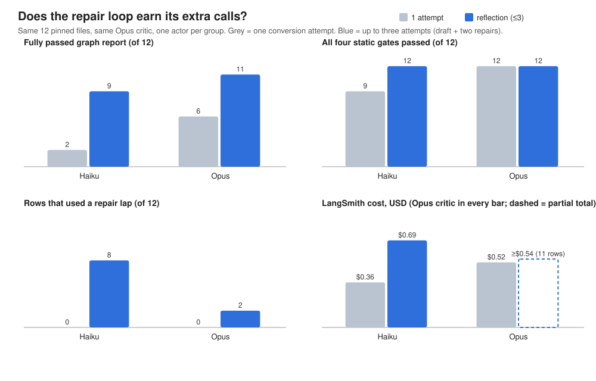

# One picture: does the repair loop earn its extra calls? (explained simply)



The picture is drawn from three A/B runs on the same 12 pinned files, with
the same Opus critic reviewing every draft. Grey is one conversion attempt.
Blue is the production setting: up to three attempts (draft + two repairs).
Only the attempt cap changes inside each pair. Every bar is copied from a
verified LangSmith receipt by `scripts/render_actor_shootout.py`; nothing is
typed by hand. The numbers: [reflection-shootout-table.md](reflection-shootout-table.md).

## How to read it in one minute

| Actor writing the code | One attempt | With reflection | What the loop did |
| --- | --- | --- | --- |
| **Haiku** (small, cheap) | 2 of 12 fully passed; 3 files did not compile | 9 of 12; everything compiles | 8 files repaired; every compile failure fixed |
| **Sonnet** (mid) | 11 of 12 | 10 of 12 | 3 files repaired; no static failures to fix; one critic-variance swing |
| **Opus** (large) | 6 of 12 | 11 of 12 | 2 files repaired; 4 more "improvements" were critic variance |

Three takeaways.

1. **Reflection earns its cost when first drafts are often wrong.** Haiku's
   drafts fail to compile a quarter of the time; the loop reads the compiler
   and the critic, retries, and ends with all 12 compiling. That is the loop
   working exactly as designed.
2. **When first drafts are already clean, the loop mostly re-litigates the
   critic's opinion.** Sonnet and Opus both pass every static gate on the
   first try. Their blue bars move because the critic asked for a revision,
   and the critic does not say the same thing twice about the same kind of
   draft. That is variance, and the comparison labels it that way.
3. **The critic is the bill.** Opus reviews every lap in every bar. With a
   cheap actor the loop runs more laps, so the reviewer's cost nearly
   doubles. Sonnet alone reaches the same fully-passed count as Opus with
   reflection at about half the price; Haiku with reflection costs more than
   Sonnet alone and passes fewer.

So, on this dataset: the cheapest actor that does not need the loop is
Sonnet; the loop is what makes Haiku usable at all; Opus benefits a little.

## What it does not show

- Static gates and the critic's verdict, not a browser run.
- One run per arm. A one-file difference is inside the noise of the critic.
- No Haiku or Sonnet critic. Changing the critic and the actor together
  would break the "one thing changes" rule of the A/B.

## Where the runs are

- Haiku: [reflection-haiku-ab.md](reflection-haiku-ab.md) (plain English),
  [phase-6.5-haiku-report.md](phase-6.5-haiku-report.md) (evidence).
- Sonnet: [phase-6.5-sonnet-report.md](phase-6.5-sonnet-report.md).
- Opus: [reflection-ab.md](reflection-ab.md), [phase-6.3-report.md](phase-6.3-report.md).

## Redrawing it

```bash
.venv/bin/python scripts/render_actor_shootout.py \
    Haiku=docs/phase-6.5-haiku-comparison.json \
    Sonnet=docs/phase-6.5-sonnet-comparison.json \
    Opus=docs/phase-6.3-comparison.json \
    --svg docs/reflection-shootout.svg --md docs/reflection-shootout-table.md
```

The renderer refuses a receipt whose arms are not comparable and refuses to
mix critics, so a broken run can never end up in the picture.
