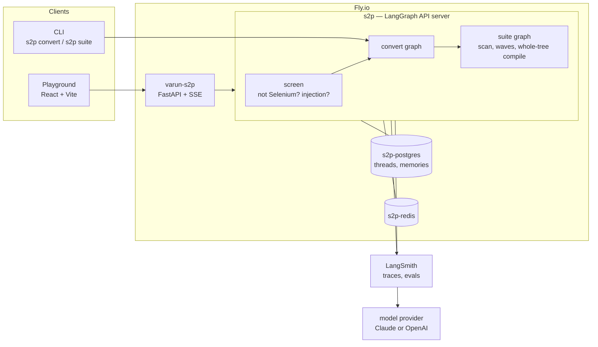

# Architecture and decisions

What Selenium2Playwright is, how it is put together, and which decisions were
reversed on the way. The [build log](docs/build-log.md) records the order things
happened in; this page records the shape they settled into.

Everything below describes what is in the repository today. Where a decision
was made and later overturned, §9 says so and why.

---

## 1. What it does

One agent, two scopes.

| Scope | Input | Output | Where it runs |
|---|---|---|---|
| Single file | one Selenium page object, or one `*.test.ts` / `*.spec.ts` | the Playwright equivalent, plus a scorecard | playground, CLI |
| Whole suite | a folder of page objects, specs, fixtures and config | a Playwright project, compiled as one tree, plus a conversion report and a `TODO(review)` ledger | CLI only — see §8 |

**Source scope is `selenium-webdriver` in TypeScript.** WebdriverIO, Cypress,
Puppeteer and code that is already Playwright are **refused with a reason**, not
converted. A refusal costs nothing: the classifier runs before any model call.

**The quality bar.** Output compiles under `tsc --noEmit`, contains zero
Selenium APIs, keeps the same test cases and assertion coverage as the source,
and is idiomatic Playwright — auto-waiting rather than explicit waits, web-first
assertions, role and test-id locators where they can be inferred. Anything that
cannot be verified ships as an explicit `TODO(review)`. The agent never invents
an API to make a file look finished.

**Not built, and not scheduled:** Selenium in Java, Python or C#; Cypress input;
partial conversion of a file the agent only half understands. The output-side
gate stack (compile, lint, residue, parity) would be reused unchanged for a new
source language, so the cost of one is a playbook plus source-side parsing — but
none of that exists today.

## 2. Design principles

1. **Boring where possible, agentic where it pays.** A versioned mapping
   playbook (`docs/playbook.md`) handles the mechanical majority. The model
   handles structure, naming and judgment. Deterministic checks decide whether
   the result is acceptable.
2. **The model cannot lie to the compiler.** Every attempt is checked by tools
   that do not care what the model claims.
3. **Honesty is a feature.** An unconvertible pattern becomes a visible
   `TODO(review)` or a refusal. Silence is the failure mode this project exists
   to prevent.
4. **Measure before claiming.** A prompt or playbook change ships only after an
   A/B run on a fixed set. Every published number names the model it came from.

## 3. Architecture as built



| Component | Role | Tech |
|---|---|---|
| Conversion graph | intake → recall → risk review → convert → validate → critic → assemble, with a bounded repair loop | `langgraph`, `langchain` |
| Model | conversion and critique | any LangChain chat model, selected by `S2P_MODEL` as `provider:model`; Claude by default, OpenAI verified end to end; `--model` and `--critic-model` override per run |
| Validators | the checks the model cannot fake | pinned Node toolchain under `sandbox/`, called as subprocesses: `tsc --noEmit`, typed ESLint (including a project-specific dialog-ordering rule), a Selenium-residue scan, and an AST structure-parity check |
| Short-term memory | per-thread conversation and suite progress | LangGraph checkpointer — Postgres in production, SQLite locally |
| Long-term memory | team conventions carried across conversations | LangGraph Store with semantic search |
| Playground | paste a file, watch the graph run, read the scorecard | React + Vite over a FastAPI server that streams progress as server-sent events |
| CLI | `s2p convert`, `s2p suite`, `s2p memories`, `s2p threads` | Typer |
| Observability | traces, experiments, judge runs | LangSmith |

## 4. The conversion graph

```
intake → recall → risk_review → convert → validate → critic → assemble
                                   ▲                     │
                                   └── repair (≤ 3) ─────┘
```

Before `intake`, input is **screened without a model call**: a file that is not
Selenium, or that carries text aimed at the model — in a comment, a string,
look-alike letters, invisible characters — is refused there.

1. **intake** — classify the file, or refuse it honestly.
2. **recall** — fetch the few remembered conventions that apply to this file.
3. **risk_review** — three Selenium patterns have more than one correct
   Playwright answer (dialogs, `executeScript`, a session shared by a `before`
   hook). With `--thread`, the run suspends and asks. The public playground
   never pauses a stranger mid-run: it applies the playbook's default and names
   the choice on the result.
4. **convert** — one unit at a time. Each call carries one Selenium file, the
   page objects it imports, and in suite mode a capped slice of the files that
   call it. The agent is never pointed at a repository and never explores one.
5. **validate** — the four gates. Four of the five checks in a lap are a
   compiler, a linter and two AST scripts, so a repair lap is nearly free.
6. **critic** — a model reviews idiom on top of the gates.
7. **repair** — re-convert against the actual findings, at most three times.
8. **assemble** — always report the outcome and keep the best draft, even when
   the cap is hit.

## 5. Suite mode

A scan decides which files use Selenium at all; helpers, fixtures and config are
copied across untouched, with no model call. Page objects convert first, then
the specs that import them, in parallel waves. The delivered tree is then
compiled **as one project**, because twelve files that each compile alone are
not the same as a suite that compiles. The report carries a per-file verdict and
one consolidated `TODO(review)` ledger.

## 6. Evaluation

Five measurements, each one reproducible and each naming its model:

- **The 12-file sample suite** through all four gates and the critic.
- **The twelve SDET hard cases** — patterns where a mechanical translation
  compiles, passes lint, passes the residue scan, and silently tests something
  else.
- **A self-correction A/B** — does the repair loop earn its extra calls?
- **A calibrated LLM judge**, with a second judge run to measure agreement.
- **Execution** — converted rows replayed in a real browser in CI, plus 790+
  offline tests on every push, with no keys and no tokens.

Numbers, method and the failures are in
[the evaluation page](https://varun-s2p.fly.dev/evaluation) and the reports
under [`docs/`](docs/). What is still unsolved is written down in
[hard-cases.md](docs/hard-cases.md) rather than left for a user to discover.

## 7. Repository layout

```
src/selenium2playwright/   the agent: graph, nodes, validators, memory, CLI, evals
sandbox/                   the pinned TypeScript toolchain the gates shell out to
ui/web/                    the React + Vite playground
ui/server.py               the FastAPI server that streams the graph to it
samples/                   the Selenium suites and their goldens, for demos and evals
tests/                     the offline suite: no keys, no tokens
scripts/                   eval harness, diagram generation, comparison tooling
deploy/fly/                the deployment: app configs, Dockerfiles, runbook
docs/                      walkthroughs, evaluation reports, the playbook
.github/workflows/         CI: offline checks, browser execution gates, CodeQL
```

## 8. Deployment and operating limits

Four Fly apps in one region: `s2p` (the LangGraph API server, image pinned),
`varun-s2p` (the playground), and Postgres and Redis on a private network. The
demo runs on a real card, which decides two things:

- **Single files are public; whole suites are not.** Converting a folder is
  dozens of model calls in one click. `s2p suite` runs on your own machine with
  your own key — the same agent, the same gates.
- **Every run is metered.** A per-visitor cap and a shared daily dollar budget,
  both enforced before the model is called; the page shows what is left today.

Production validation is static only. The agent never executes submitted code;
execution evals run in CI, on the project's own fixtures.

## 9. Decisions that were reversed

The reasoning behind each is in the linked write-up. They are listed here
because a plan that only records the decisions that survived is not a useful
record.

| Decision | What replaced it | Why |
|---|---|---|
| Deploy on LangGraph Platform | Self-hosted LangGraph API server on Fly | The gates shell out to a pinned Node toolchain; the managed base image is Python-only, and the sandbox is not in the build context. Shipping without the gates was the one option this project could not take. [deploy.md](docs/deploy.md), [hosting-comparison.md](docs/hosting-comparison.md) |
| Streamlit playground | React + Vite over FastAPI | Streamlit re-runs the file on every click: a fine place for a layout, a poor place for anything worth testing, and no way to stream the graph honestly. `ui/app.py` remains as the first version, local only. [playground.md](docs/playground.md) |
| Claude only, with an env var to downshift | Model-agnostic: `S2P_MODEL` as `provider:model` | Vendor quirks belong in `llm.py`; everything else uses LangChain abstractions. This is also what made the cross-model evals possible. [config.md](docs/config.md) |
| WebdriverIO converted best-effort with a warning | Refused, with the reason | A best-effort conversion of an out-of-scope framework is exactly the silent-wrongness this project exists to prevent. |
| Whole-suite conversion in the public playground | Local only, by cloning | Cost. A single visitor's folder can be dozens of model calls. |
| Partial conversion of a file | All or a refusal | Half a converted file is worse than none: it looks finished. |

## 10. Risks, and what is done about them

- **Prompt injection.** Input that talks to the model is refused before a model
  sees it, the model is told the file is data, and a conversion that imports
  anything the source never did fails parity. [guardrails.md](docs/guardrails.md)
- **Cost.** Repair capped at three laps; four of five checks are free; per-visitor
  and daily budgets; no repository exploration.
- **Quality drift.** No playbook or prompt change merges without an A/B run on a
  fixed set, and CI replays the golden fixtures in a real browser on every push.
- **Availability.** Two concurrent suite runs wedged the graph once. The
  diagnosis, the fix and the remaining hardening are written down in
  [prevention-backlog.md](docs/prevention-backlog.md).

## 11. Where v1 landed

Shipped: the graph and its four gates; the repair loop and critic; short- and
long-term memory; human-in-the-loop on ambiguous patterns; the CLI; whole-suite
conversion; five evaluation layers with published numbers; a deployed playground
anyone can use without signing up; CI that gates every push.

Open, and honest about it: the browser-execution numbers are not 100%, and
[hard-cases.md](docs/hard-cases.md) names the patterns that still defeat the
converter; suite conversion is not available to visitors; the outage-prevention
backlog has items left. Each of those is a link away, not a footnote.
