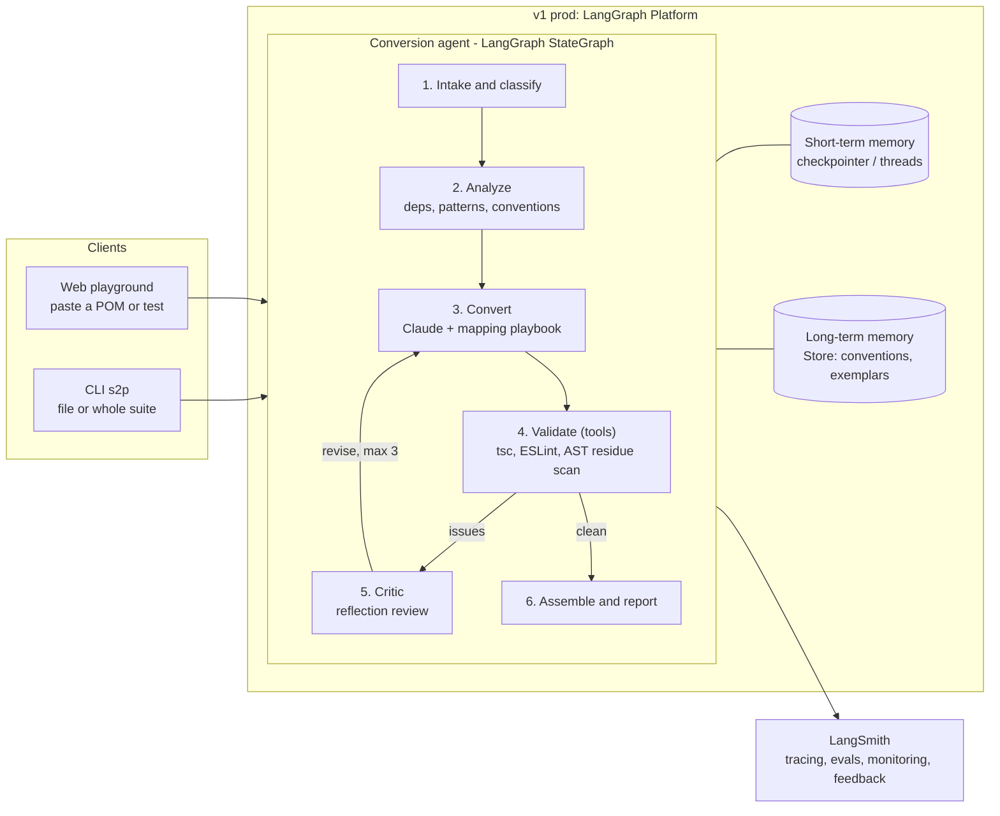

# Selenium2Playwright — v1 Plan

An AI agent that migrates **TypeScript Selenium** test suites to **Playwright** — built in public through the full **Agent Development Lifecycle** (build → evaluate → deploy → monitor → improve) using **LangGraph + LangChain, LangSmith, and Claude**.

**Two audiences, two proof points:**
- **SDET hiring managers:** paste your own Selenium POM → get a *correct, idiomatic* Playwright POM.
- **LangChain/AI hiring managers:** a well-engineered agent — graph design, reflection, short/long-term memory, evals, deployment, prod monitoring.

---

## 1. What it does

One agent, three conversion scopes:

| Scope | Input | Output | Surface |
|---|---|---|---|
| Single test | one `*.test.ts` / `*.spec.ts` (selenium-webdriver + Jest/Mocha) | `@playwright/test` test file | Playground + CLI |
| Page Object (POM) | one page-object class | Playwright POM (`Locator` fields, async methods) | Playground + CLI |
| Whole suite | folder: POMs + tests + config | full Playwright project incl. `playwright.config.ts` + conversion report | CLI (playground later) |

**The v1 quality bar (the demo promise):** output always compiles (`tsc --noEmit`), contains **zero** Selenium APIs, and is idiomatic Playwright — auto-waiting instead of explicit waits, web-first assertions, `getByRole`/`getByTestId` where inferable. Anything uncertain gets an honest `// TODO(review)` note — never an invented API.

**North star (post-v2):** accept Selenium in *any* language (Java, Python, C#…) — the output stays Playwright TS. Fixing the target language means the entire output-side gate stack (compile, lint, residue, output parity) is reused as-is; each new source language costs only a playbook + source-side parsing (classify, source parity counting). MVP is strictly Selenium TS → Playwright TS.

**Two flagship demo moments (the LinkedIn video):**
1. Paste a real POM into the hosted playground → watch convert → validate → reflect → ✅ badges.
2. `s2p convert samples/selenium-suite/` → converted project passes `npx playwright test` against the bundled demo app.

**Scope guardrail:** v1 targets `selenium-webdriver` + Jest/Mocha only. WebdriverIO/Protractor input is detected and converted best-effort with a clear warning (WebdriverIO = candidate v1.5).

## 2. Design principles

1. **Boring where possible, agentic where it pays.** A versioned Selenium→Playwright *mapping playbook* (deterministic rules in the system prompt + AST checks) handles the mechanical 80%; the LLM handles structure, naming, and judgment; a validation loop guarantees the result compiles.
2. **Never trust a single LLM pass.** Every conversion runs validate → critique → refine (reflection pattern).
3. **Honesty is a feature.** Uncertainty is flagged for human review in the conversion report — SDETs trust tools that admit limits.
4. **Small steps.** Every milestone is shippable, teaches one LangChain/LangGraph concept, and maps to an LCAE exam topic.

## 3. High-level architecture (v1)



| Component | Role | Tech |
|---|---|---|
| Conversion agent | StateGraph: analyze → convert → validate → reflect loop | `langgraph`, `langchain` v1 |
| LLM | code transformation + critique | `claude-opus-5` via `langchain-anthropic` (`init_chat_model`; env var flips to `claude-sonnet-5` for ~2.5× lower cost); Anthropic prompt caching on the playbook |
| Validator tools | deterministic checks the LLM can't fake | Node toolchain via subprocess: `tsc --noEmit`, ESLint + `eslint-plugin-playwright`, AST scan for leftover `selenium-webdriver` APIs |
| Short-term memory | per-thread conversation + suite progress; iterate and resume | LangGraph checkpointer (Platform-managed in prod, SQLite locally) |
| Long-term memory | cross-thread learned mappings, conventions, exemplar bank | LangGraph Store with semantic search |
| Evals | offline dataset evals + CI gate + online evals on prod traffic | LangSmith (+ `openevals` LLM-as-judge) |
| Playground | paste code → streamed conversion + validation badges | Streamlit app calling the deployed graph (`langgraph-sdk`) |
| CLI | `s2p convert <path>` | Typer |
| Monitoring | traces, latency/cost/error dashboards, alerts, 👍/👎 feedback | LangSmith |

## 4. The conversion graph (heart of the project)

State (simplified): `scope, source_files, analysis, converted_files, validation, critique, iteration, report`.

1. **Intake & classify** — detect scope (test / POM / suite) and framework; warn on out-of-scope flavors.
2. **Analyze** — build the dependency graph (suite mode), detect conventions: naming, wait style, assertion library.
3. **Convert** — one unit at a time; playbook + exemplars retrieved from long-term memory as few-shots. **POMs convert before tests**, so tests see the converted POM interfaces.
4. **Validate** — deterministic tools: compile, lint, Selenium-residue scan, structure parity (every public method preserved; same test-case count and assertion coverage as the source — any drop is a validation failure that feeds the refine loop).
5. **Critic (reflection)** — LLM reviews for idiom: no `waitForTimeout`, web-first assertions, locator quality; returns a structured verdict.
6. **Refine loop** — re-convert with validator errors + critique; max 3 iterations, then flag `needs-review` instead of looping forever.
7. **Assemble & report** — write files, generate `playwright.config.ts`, per-file confidence + review notes, and a consolidated `TODO(review)` ledger: every TODO across the whole conversion collected in one place, pointed to at the end of the run (playground panel / CLI report file).

Suite mode fans out per-file conversion in parallel with the **Send API**, respecting dependency order and sharing one "suite context" from Analyze. **Human-in-the-loop** (M4+): on ambiguity (e.g., a POM imports a file that wasn't provided), interrupt and ask rather than guess.

## 5. Memory design

- **Short-term (thread-scoped, checkpointer):** conversation + suite progress. Demo: convert a POM, then say *"now use data-testid for all locators"* — no re-pasting; resume a half-done suite conversion.
- **Long-term (cross-thread, Store):**
  - *Convention memories* — a user's/team's preferences (locator strategy, naming).
  - *Mapping memories* — corrections users make become learned rules applied next time.
  - *Exemplar bank* — high-scoring past conversions retrieved semantically as few-shot examples.
  - Demo: correct the agent once, start a fresh thread, watch it apply the lesson.

## 6. Evals (LangSmith)

**Dataset:** 25–40 curated Selenium→Playwright pairs — POMs, tests, edge cases (explicit waits, `Select`, iframes, alerts, action chains, `executeScript`), plus out-of-scope traps (WebdriverIO input).

**Three evaluator layers:**
1. **Deterministic** (cheap, objective): compiles, zero Selenium residue, structure parity (methods + test count + assertion coverage vs. source), lint-clean.
2. **LLM-as-judge** (`openevals`): semantic equivalence + idiomatic-Playwright rubric, scored 1–5.
3. **Execution** (CI only, curated inputs only): the converted sample suite runs green via `npx playwright test` against the bundled demo app.

**Cadence:** every prompt/playbook/graph change → a LangSmith experiment; a GitHub Actions gate blocks regressions. In prod: online evals score sampled traffic; 👎 feedback auto-lands in a triage dataset — the data flywheel.

**Tracked metrics:** compile-pass %, residue rate, judge average, execution pass %, tokens + cost per conversion, p50 latency.

## 7. ADLC mapping (the README story)

| Stage | How this project does it |
|---|---|
| **Build** | LangGraph Studio + `langgraph dev`; prompts/playbook versioned in repo; pytest unit tests on nodes (fake LLM) |
| **Evaluate** | LangSmith datasets + experiments; CI regression gate before any deploy |
| **Deploy** | LangGraph Platform from the GitHub repo; new revision on merge to `main` |
| **Monitor** | LangSmith prod project: traces, latency/cost/error dashboards, an alert rule, online evals, user feedback capture |
| **Improve** | feedback → dataset → playbook/prompt fix → eval gate → redeploy (documented loop diagram in README) |

## 8. v2 — Amazon Bedrock AgentCore (post-LCAE)

- **AgentCore Runtime** hosts the *same* LangGraph agent (framework-agnostic) — a deployment-substrate swap, graph unchanged.
- **Model continuity:** same Claude family via Bedrock.
- Evaluate **AgentCore Memory** for the long-term store and **AgentCore Observability** (OTEL/CloudWatch) alongside LangSmith; Gateway/Identity only if needed.
- Deliverable: a "LangGraph Platform → AgentCore" migration write-up — strong content for the AWS crowd.

## 9. Roadmap — small steps

Rule: 1–2 focused sessions per milestone; never start M(n+1) with M(n) unshipped. Each milestone is a LinkedIn-postable increment.

| # | Milestone (what ships) | What you learn (LCAE-aligned) |
|---|---|---|
| M0 | Walking skeleton: repo scaffold; bundled demo web app + sample Selenium suite (3 POMs, ~8 tests); a one-prompt POM conversion script; **LangSmith tracing on from day 1** | chat models, messages, prompt templates, tracing |
| M1 | First graph: analyze → convert → validate; tsc/ESLint/residue tools | StateGraph, state, nodes/edges, tool calling |
| M2 | Reflection: critic node + bounded refine loop | conditional edges, reflection pattern, structured outputs |
| M3 | Short-term memory + CLI: checkpointer, threads, conversational iteration; `s2p convert file.ts` | persistence, threads, interrupts |
| M4 | Suite mode: dependency ordering, parallel fan-out, config generation, conversion report | Send API / map-reduce, subgraphs, HITL |
| M5 | Evals: dataset + 3 evaluator layers + CI gate | LangSmith datasets, evaluators, experiments |
| M6 | Long-term memory: Store + exemplar retrieval + feedback capture | Store, semantic search, memory patterns |
| M7 | **Ship v1:** deploy to LangGraph Platform; Streamlit playground; dashboards, alert, online evals | Platform deploy, Studio, prod monitoring |
| M8 | Launch polish: README (architecture diagram, 60-sec GIF, eval scorecard, honest limitations), LinkedIn assets | — |

## 10. Repo layout & kanban

```
Selenium2Playwright/
  agent/            # langgraph app: graph.py, state.py, nodes/, tools/, prompts/ (playbook), memory/
  cli/              # s2p (Typer)
  ui/               # Streamlit playground
  evals/            # datasets/, evaluators/, run_evals.py
  samples/
    demo-app/       # tiny web app (login + todo pages) the suites run against
    selenium-suite/ # realistic selenium-webdriver TS suite — demo input + execution-eval fixture
  tests/            # pytest unit tests (nodes, tools, no-LLM)
  docs/             # architecture.md, adlc.md, decisions/ (mini ADRs)
  .github/workflows/  # ci: ruff + pytest + eval gate
  langgraph.json · pyproject.toml (uv) · docker-compose.yml · README.md
```

**Kanban:** public GitHub Projects board — columns `Backlog / Next / In progress / Done`; one milestone = one iteration, split into 3–6 small issues. A public board is itself a signal of process maturity.

## 11. Guardrails & risks

- **Never execute user-submitted code.** Prod validation is static-only (tsc, ESLint, AST). Execution evals run only on our own curated dataset in CI.
- **Cost control:** reflection capped at 3 iterations; prompt caching on the large, stable playbook; per-request size limit; playground rate limit; LangSmith cost dashboard + spend alert; one env var downshifts `claude-opus-5` → `claude-sonnet-5` if demo traffic spikes.
- **Quality drift:** no prompt/playbook change merges without a green eval run.
- **Scope creep:** WebdriverIO, Cypress, Python/Java Selenium are explicitly out of v1 — listed as roadmap in the README instead.

## 12. Definition of done for v1 (the launch checklist)

- [ ] Hosted playground: an arbitrary selenium-webdriver TS POM → compiling, idiomatic Playwright POM in ≲1 min, with validation badges.
- [ ] `s2p convert samples/selenium-suite/` → converted project passes `npx playwright test` against the demo app.
- [ ] Eval scorecard in README: ≥95% compile pass, 0 residue, judge ≥4/5, execution suite green.
- [ ] LangSmith prod monitoring live: dashboard + at least one alert + the feedback flywheel demonstrated.
- [ ] README: demo GIF, architecture diagram, ADLC write-up, honest limitations section.
- [ ] LinkedIn: demo video + "how it's built" post (after the LCAE result 🎉).
